# Gravity Anomaly Graphics Log

This document links screenshots to their respective original papers for the data cleaning and preprocessing study.

---
### Archipelago : Canary Islands
#### Island: Tenerife

 **Screenshot:**
 

  * **Description:** Map of Bouguer gravity anomalies. The thick lines point out the coast of the island and the rim of the caldera. The white areas
correspond to gaps of data. Contour interval at 4 mGal.
* **Paper:** *Internal structure of Tenerife (Canary Islands) based on gravity,
aeromagnetic and volcanological data*
* **PDF location:** *`Canarias/Tenerife/2000_Aranaetal_Tenerife_GravMag_1.pdf`

 **Screenshot:**
 

  * **Description:** Bouguer anomaly map of Tenerife. Shaded circles indicate gravity stations. Contour interval is 50 gu
  

  
  
  
  * **Description:** Bouguer anomaly map for the central part of Tenerife. Contour interval is 50 gu
  * **Paper:** *Gravity constraints on the structure and volcanic evolution
of Tenerife, Canary Islands*
  * **PDF Location:** `Canarias/Tenerife/2000_TenerifeGravity_2.pdf`

 **Screenshot:**
 
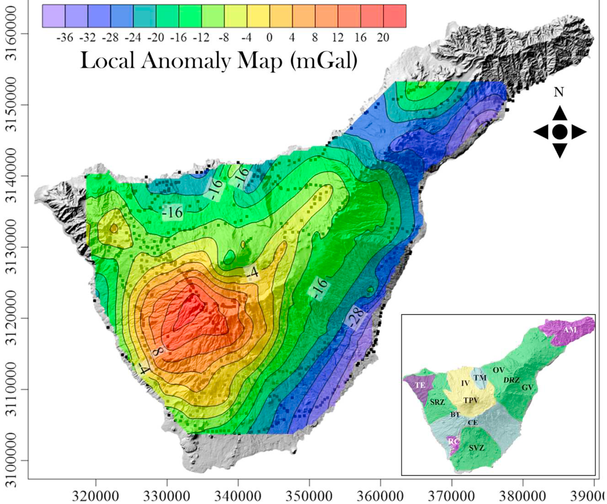

* **Description:** Local anomaly map for onshore Tenerife, after removing
a regional component from the Bouguer anomaly
map. The maximum differences in the gravity anomaly are
around 60 mGa
  * **Paper:** *Gravimetric study of the shallow basaltic plumbing system of Tenerife,
Canary Islands*
  * **PDF Location:** `Canarias/Tenerife/2019_Tenerife_PEPI_3.pdf`

#### Island: Lanzarote

**Screenshot:**
 
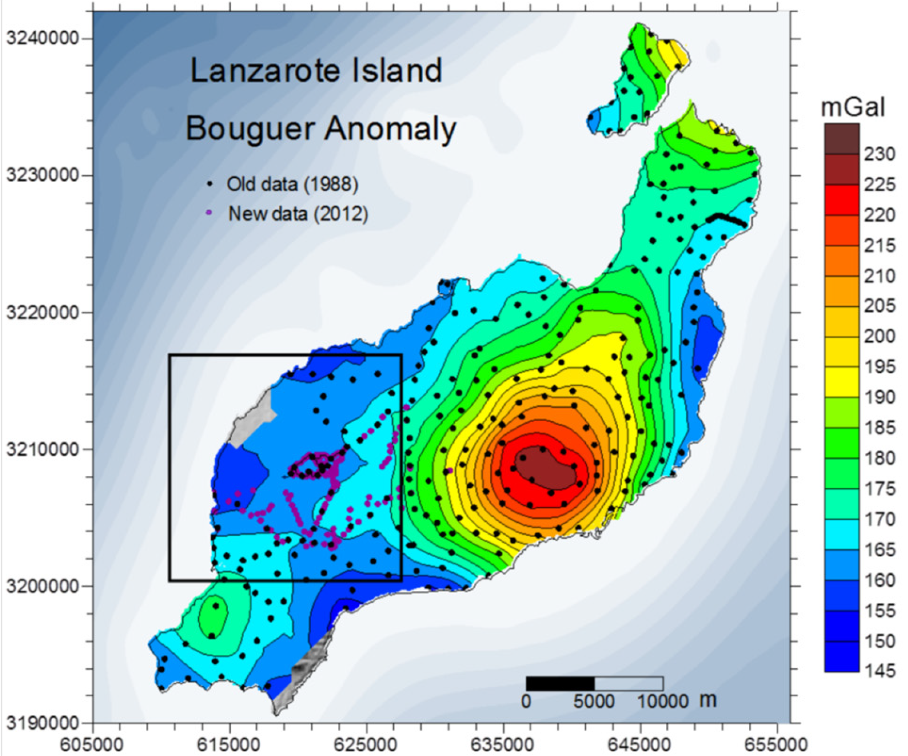

* **Description:** Map of the Bouguer anomaly observed for the island of Lanzarote (including terrain correction for a density value 2300 kg/m3). Contour interval 5mGa

**Screenshot:**
 
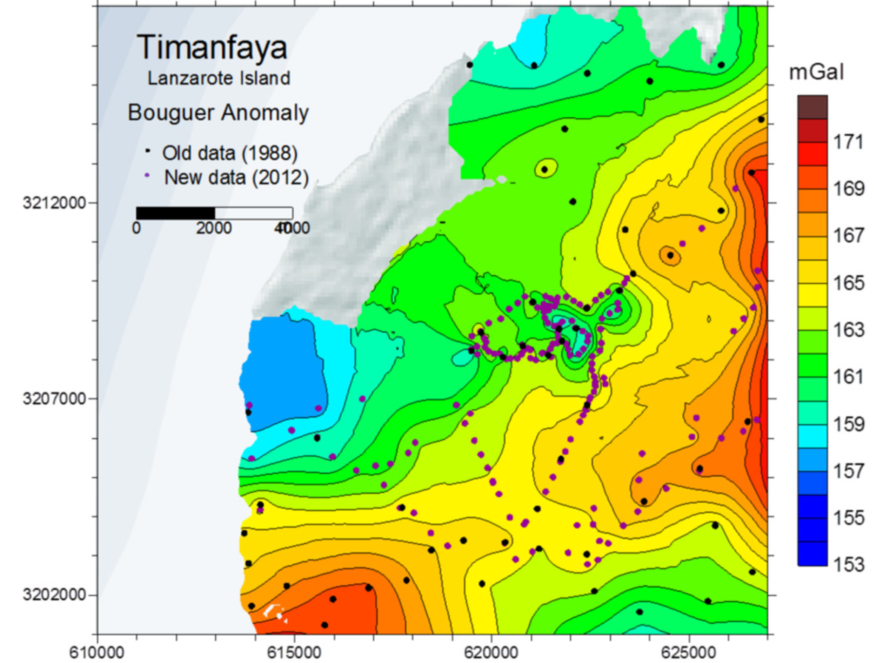

* **Description:** Zoomfor the area of
Timanfaya depicted in panel (a). Contour interval 1 mGal. Dots indicate the location of the gravity measurements.

   * **Paper:** *Deep volcanic morphology below Lanzarote, Canaries, from gravity
inversion: New results for Timanfaya and implications*
  * **PDF Location:** `Canarias/Lanzarote/2019_Lanzarote_1.pdf`
 
  
 **Screenshot:**
 
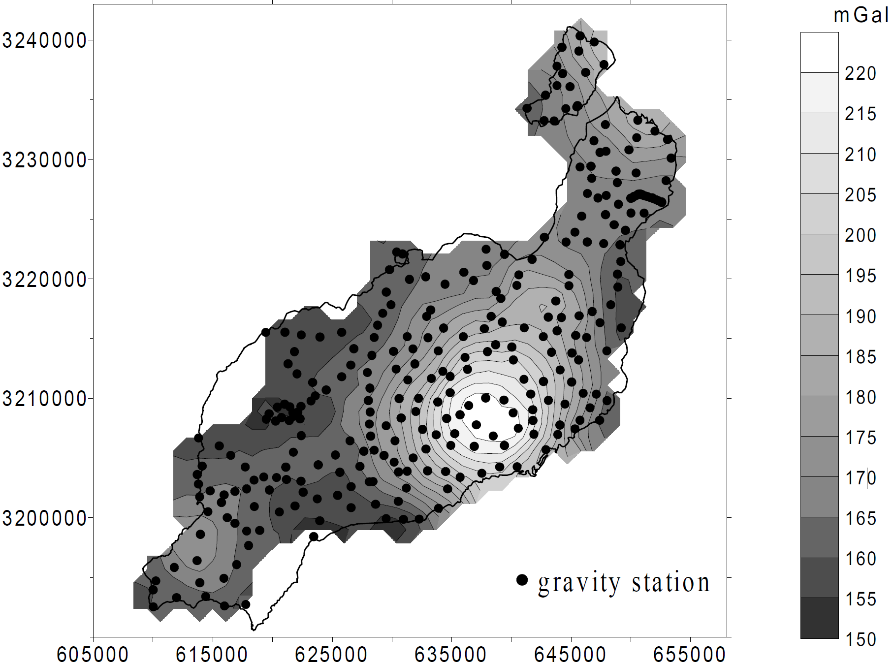

* **Description:** Distribution of gravity stations and map of the Bouguer gravimetric anomaly. The value used for the density of terrain correction is
2480 kg mx3. Contour interval are 5 mgal. UTM coordinates in metres.
   * **Paper:** *Modelling of crustal anomalies of Lanzarote (Canary Islands) in
light of gravity data*
  * **PDF Location:** `Canarias/Lanzarote/Modelling of crustal anomalies of Lanzarote (Canary Islands)_1.pdf`
 
  #### Island: La Gomera

   **Screenshot:**
 
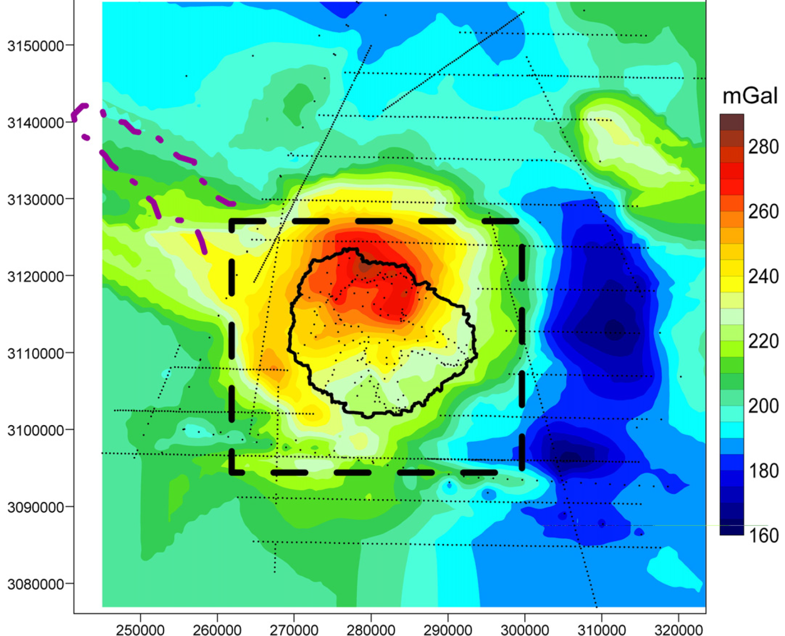

* **Description:** Map of the Bouguer gravimetric anomalies and distribution of gravity stations. The value used for the density of terrain correction is 2560 kg m−3. The contour interval is 5 mGal. The UTM coordinates are given in metres. The dotted rectangle points out the zone used in the inversion process
   * **Paper:** *Subsurface geometry and structural evolution of La Gomera island
based on gravity data*
  * **PDF Location:** `Canarias/La_Gomera/2011_LaGomera_1.pdf`
 

  **Screenshot:**
 
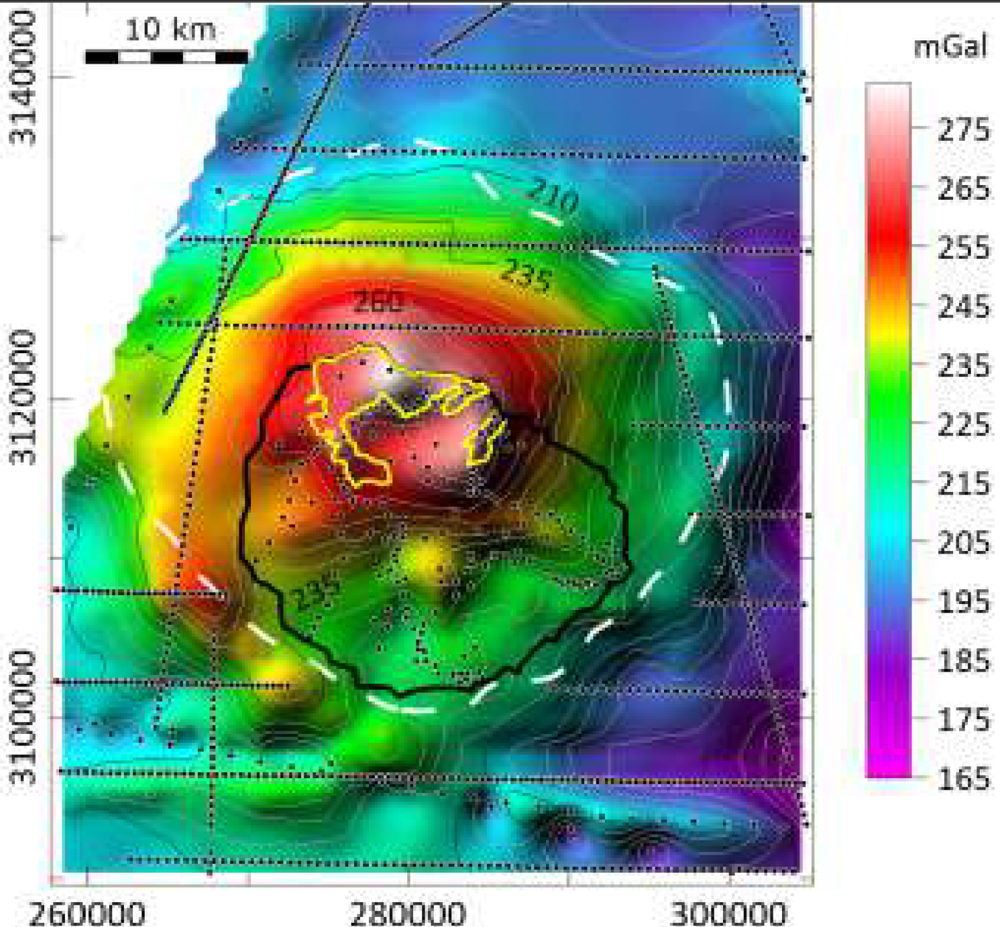

* **Description:** Bouguer gravity anomaly of La Gomera published
by Montesinos et al. (2011), which was based on land and marine gravity data (dots indicate the measurement
points).
   * **Paper:** *Three‐Dimensional Magnetic Models of La Gomera
(Canary Islands): Insights Into the Early
Evolution of an Ocean Island Volcano*
  * **PDF Location:** `Canarias/La_Gomera/2020_LaGomera_compressed_2.pdf`
  
 #### Island: Gran Canaria

**Screenshot:**
 
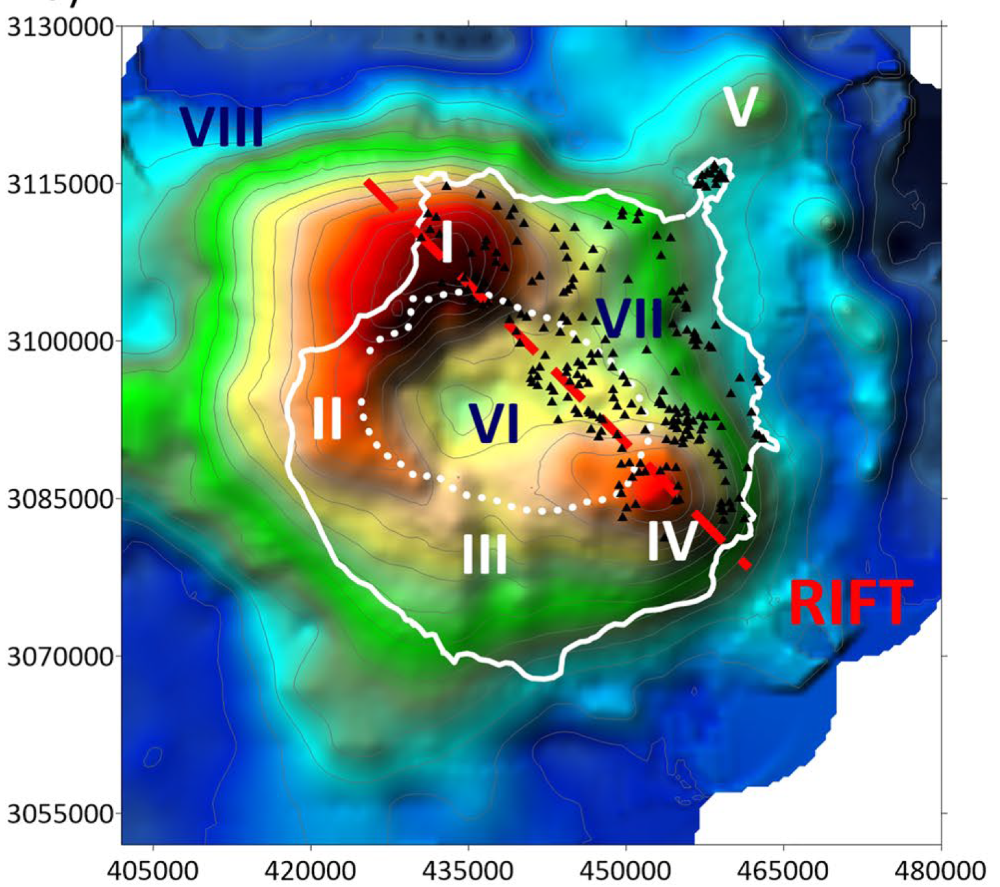

* **Description:** Map of Bouguer anomaly of Gran Canaria. The main gravity high values are identified by white numbers (I to V) and the gravity lows by black numbers
(VI to VIII). Other features are indicated: margin of Tejeda Caldera (white dots circled area), emission centers in the Neocanaria area (black triangles), rift zone (red
dotted line).
   * **Paper:** *Imaging the Volcanic Structures Beneath Gran Canaria Island
Using New Gravity Data*
  * **PDF Location:** `Canarias/Gran_Canaria/2022_GranCanaria_1.pdf`
 
#### Island: Fuerteventura

**Screenshot:**
 
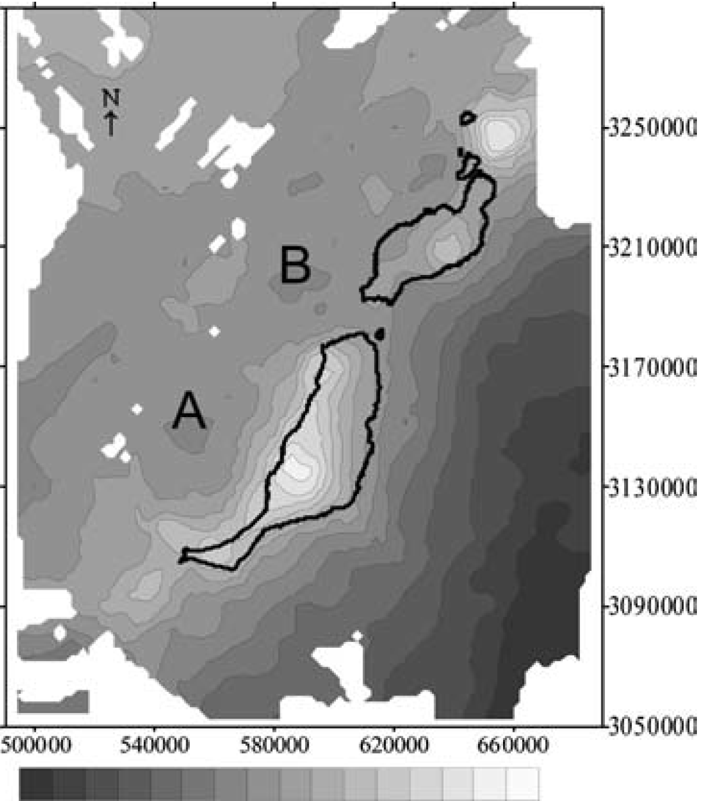

* **Description:** Map of
Bouguer gravimetric anomaly
in Fuerteventura and Lanzarote
calculated with a density of
terrain correction of 2,500 kg/
m3. The contour interval is
20 mGal. UTM coordinates in
metres.
   * **Paper:** *Using a genetic algorithm for 3-D inversion of gravity data
in Fuerteventura (Canary Islands)*
  * **PDF Location:** `Canarias/Fuerteventura/2005_Fuerteventura_1.pdf`
 
#### Island: El Hierro

**Screenshot:**
 
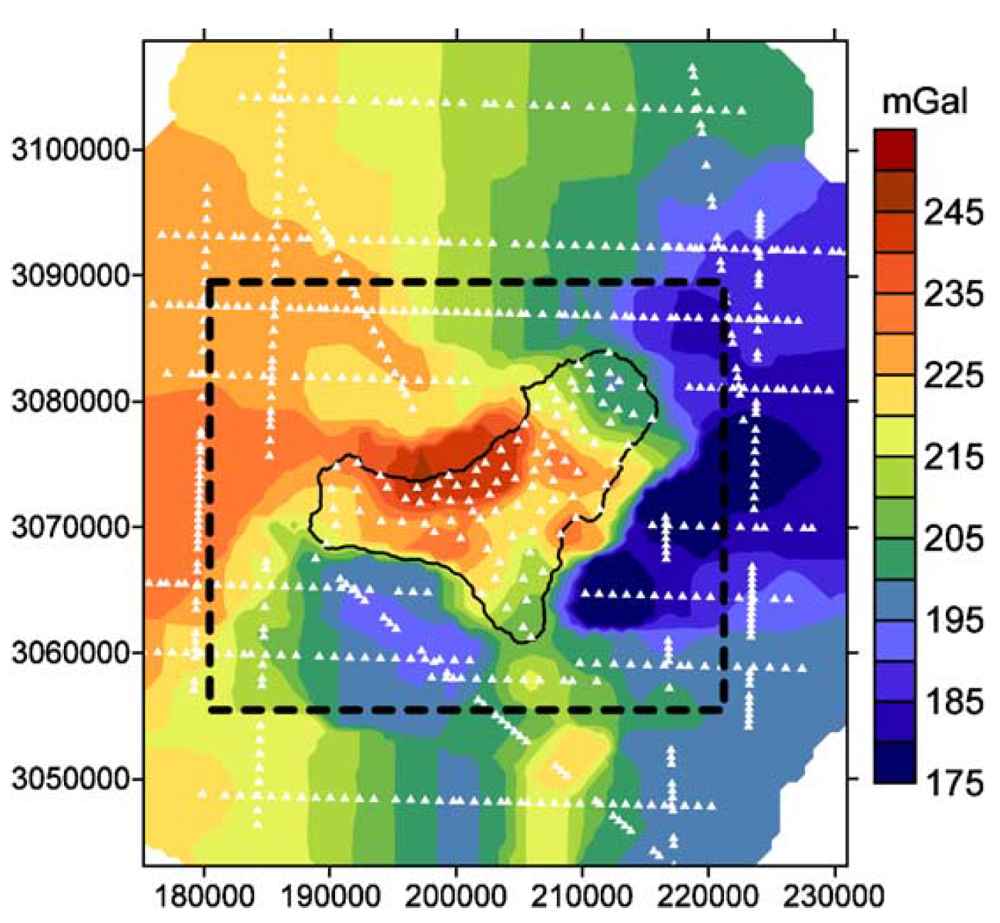

* **Description:** Distribution of gravity stations and Bouguer gravity anomaly
map. The value used for the density of terrain correction is 2510 kg
m3. Contour interval is 5 mGal. The dotted rectangle shows the
zone used in the inversion process. Maps are referenced to UTM
coordinates.

**Screenshot:**
 
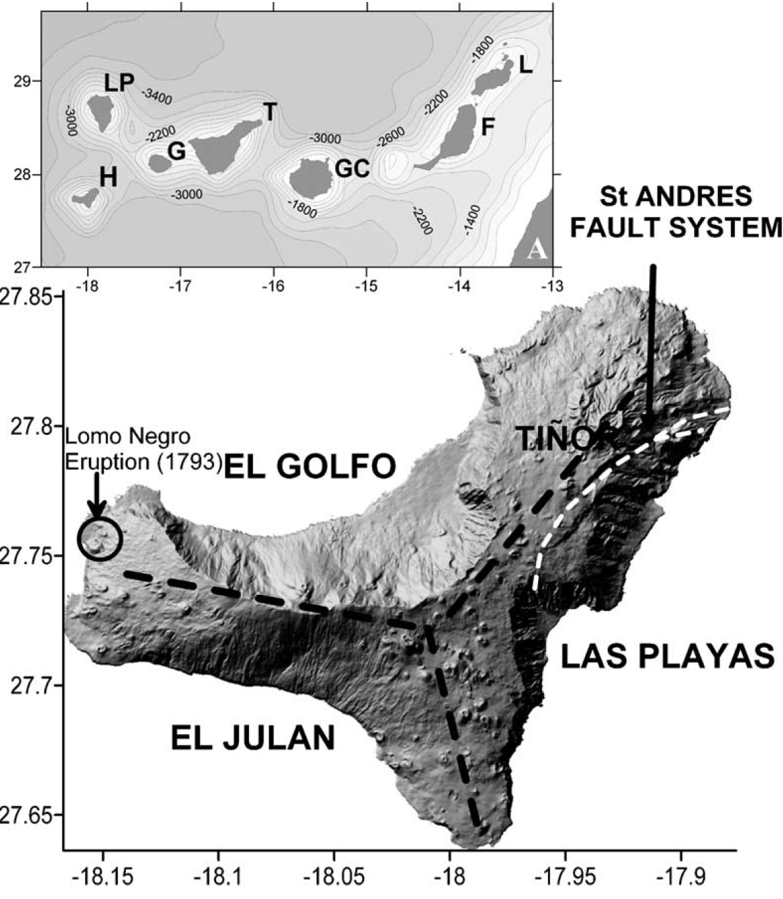

* **Description:** Geographic location of El Hierro island at the northwestern edge of the Canarian archipelago.

   * **Paper:** *The crustal structure of El Hierro (Canary Islands) from
3-D gravity inversion*
  * **PDF Location:** `Canarias/El_Hierro/2006_ElHierro_1.pdf`
 
**Screenshot:**
 
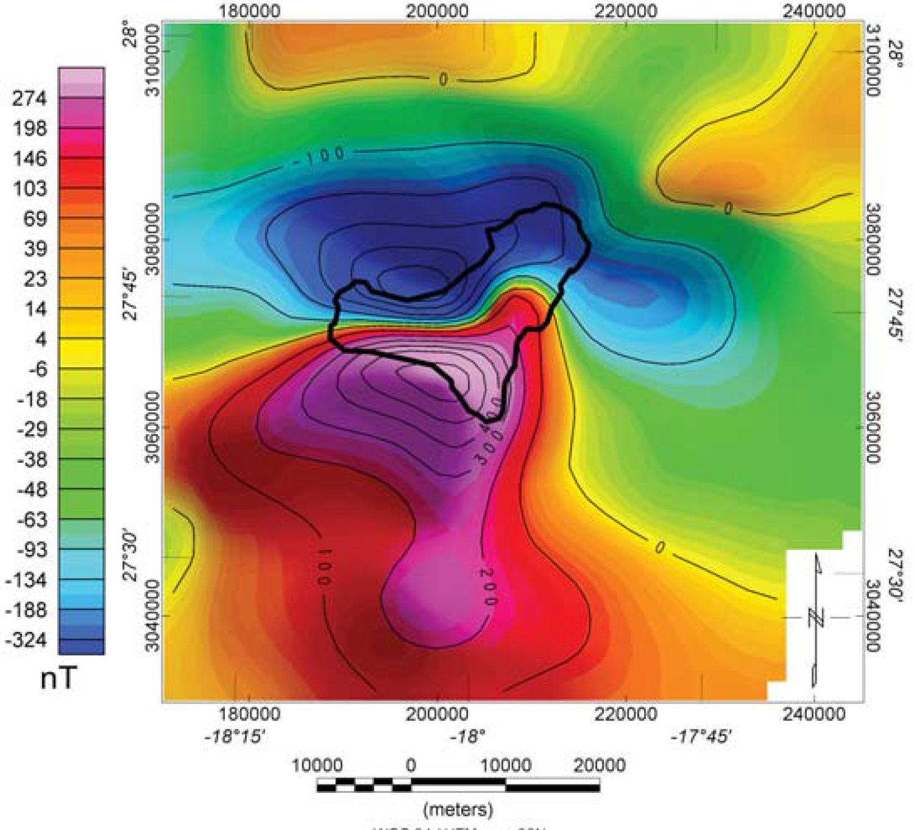

* **Description:** Aeromagnetic anomaly map of El Hierro. Two main anomalies can be easily identified: an intense normal dipole over the island and a much weaker
reverse dipole in the marine area to the northeast of the island.

   * **Paper:** *Magnetic imaging of the feeding system of oceanic volcanic islands:
El Hierro (Canary Islands)*
  * **PDF Location:** `Canarias/El_Hierro/2011_ElHierro_Mag_2.pdf`
 
 **Screenshot:**
 
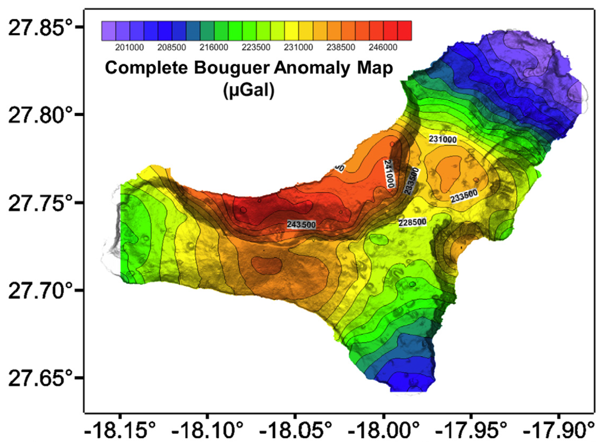

* **Description:** Complete Bouguer anomaly map for the onshore part of El Hierro Island. It showsmaximumdifferences of about 50mGal in the gravity anomaly. It is clearly visible as the highest
anomaly values are related to the giant landslides of El Golfo, El Julan, and Las Playas.

   
 **Screenshot:**
 
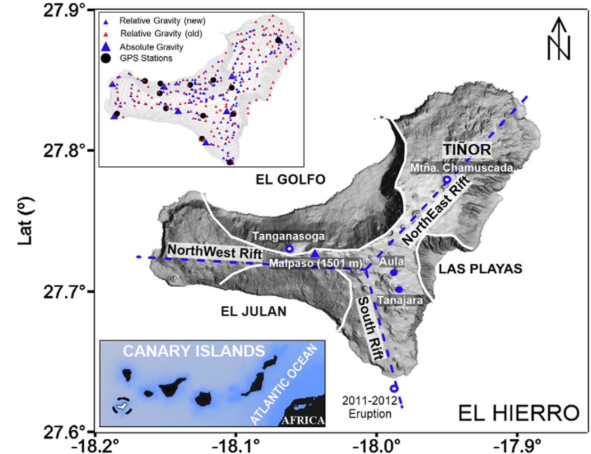

* **Description:** Shaded relief of El Hierro Island indicating its main morphological features (embayments of El Golfo, El Julan, and Las Playas, the volcanic rift systems are shown as blue dashed
lines). Locations of Quaternary eruptions, Mtña. Chamuscada, Tanganasoga and 2011–2012 submarine eruption, are highlighted as blue-white circles

 **Screenshot:**
 
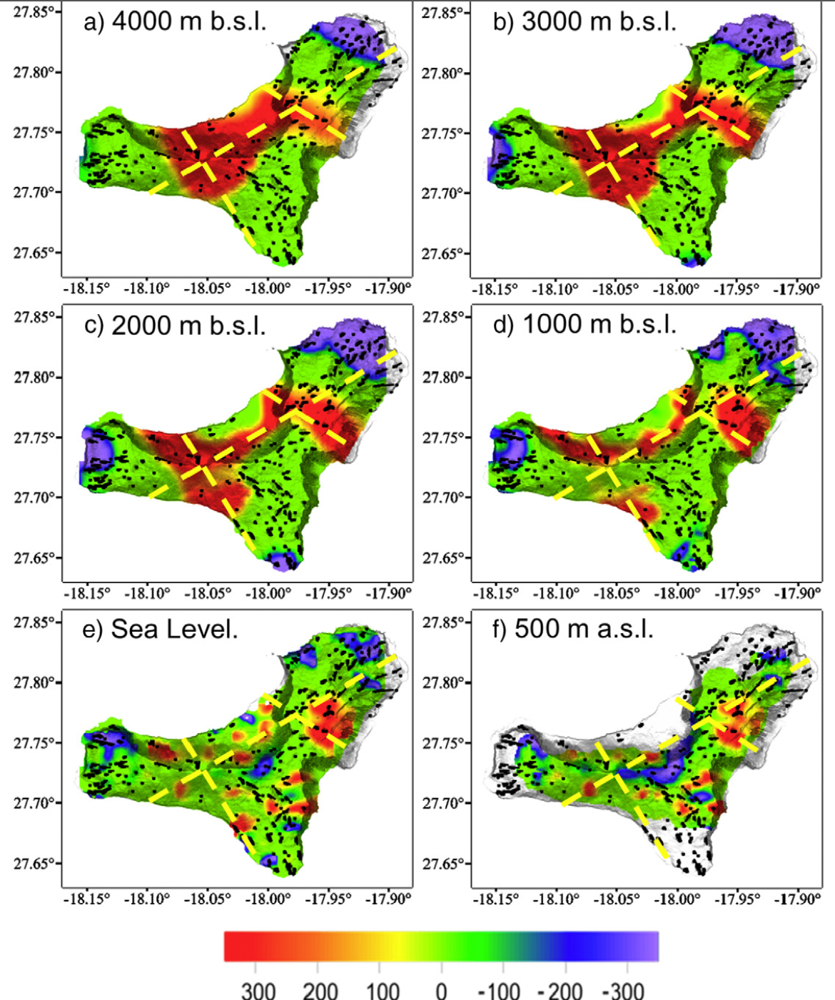

* **Description:** Bouguer anomalymap, it is showed the comparison of the anomalies with the distribution
of cones and fissures identified at surface (Becerril et al., 2015), andwith the seismicity epicenters previous to the 2011 eruption bellowthe onshore part of the island (Domínguez Cerdeña
et al., 2014).

 **Screenshot:**
 
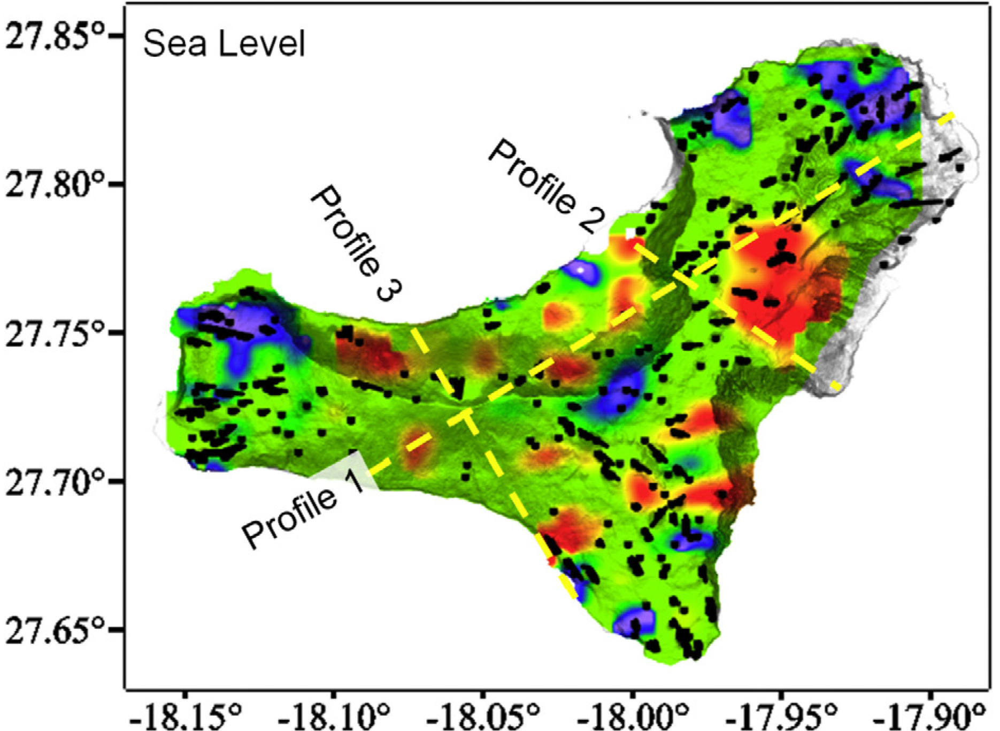

* **Description:** Horizontal sections of the density model every 1000mobtained through the genetic inversion procedure from4000mb.s.l. An additional section at 500ma.s.l. has been included in
order to display the shallower part of themodel. Yellow dashed lines point out zones or alignments of structures where high densities are outstanding

   * **Paper:** *Structural interpretation of El Hierro (Canary Islands) rifts system from
gravity inversion modelling*
  * **PDF Location:** `Canarias/El_Hierro/Interpretation of tidal gravity anomalies in Lanzarote, Canary Islands.pdf`
 

 #### Canary islands in general

 **Screenshot:**
 
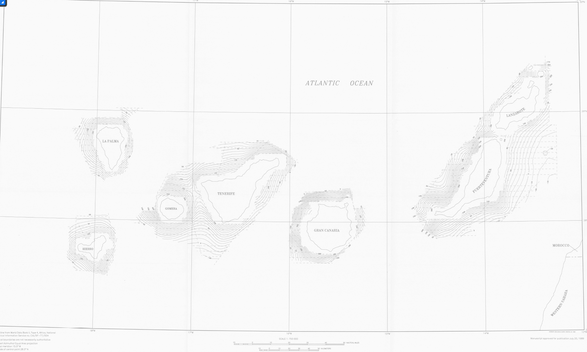

* **Description:** Canary Island free air anomalies 

   * **Paper:** *Map showing free-air gravity anomalies around the Canary islands, Spain*
  * **PDF Location:** `Canarias/1990_CanaryIslands_FreeAirAnomaly_plate-1.pdf`

  **Screenshot:**
 
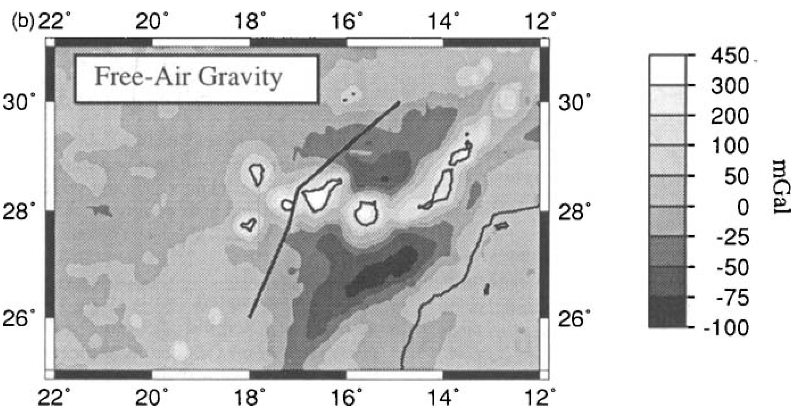

* **Description:** Free-air gravity anomaly map which has been shaded at 50mGal intervals.

  **Screenshot:**
 
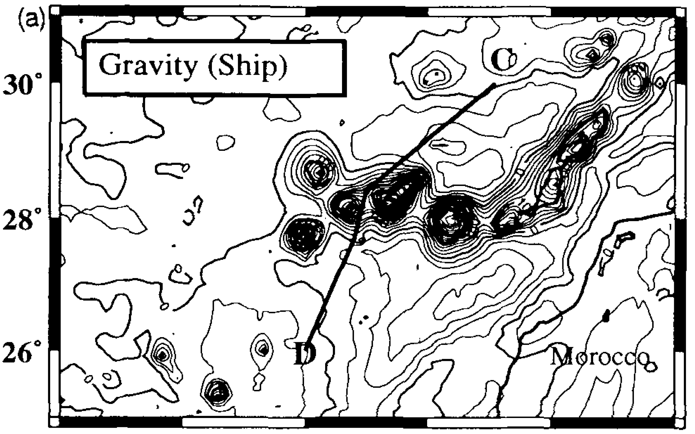

* **Description:** Comparison of observed and calculated gravity anomalies
in the Canary Islands region. The contour interval is 25 mGal.

   * **Paper:** *Crustal structure, gravity anomalies and flexure of the
in the vicinity of the Canary Islands*
  * **PDF Location:** `Crustal structure,_gravity_anomalies_in_Canary_Islands_2.pdf`
 

**Screenshot:**

 
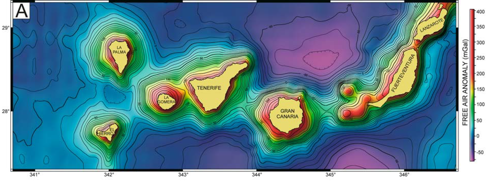

* **Description:** Free air anomaly map (contour interval = 10 mGal).

**Screenshot:**

 
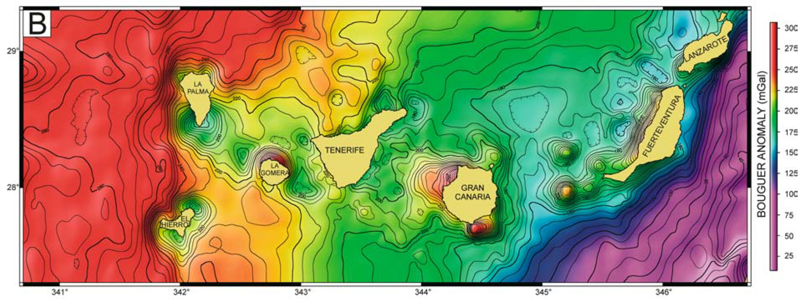

* **Description:** Bouguer anomaly map (contour interval = 5 mGal, except to the east
of Fuerteventura and Lanzarote where the contour interval = 10 mGal). The colour palette range has been emphasized for anomalies between
125–225 mGal.

**Screenshot:**

 
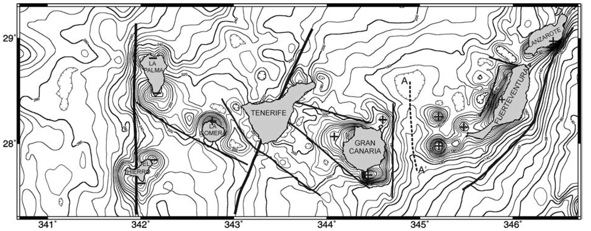

* **Description:**Interpreted Bouguer anomaly map (contour interval = 5 mGal, except to the east of Fuerteventura and Lanzarote where the contour
interval = 10 mGal). Black solid lines show linear high gravity gradients.

* **Paper:** *Gravity analysis offshore the Canary Islands from a systematic survey*
* **PDF Location:** `Canarias_gravity_3.pdf`
 
 

---
### Archipelago : Azores Islands
#### Island: Faial

1 **Screenshot:**
 

  * **Description:** Bouguer anomaly in Faial (terrain density 2390 kg m–3) supplemented with data from Pico.
 
2 **Screenshot:**
 

  * **Description:** Bouguer anomaly corresponding to the simulation model of Fig. 8 and a simulated trend p0 = 100.0 × 10−5 m s−2, px = 0.40 × 10−8 m s−2 m–1,
py = 0.0 m s−2 m–1 for the same stations of Faial. Tick marks in axes correspond to 1 km.
  

3 **Screenshot:**
 

  * **Description:** Horizontal sections of the anomalous model corresponding to depths ranging from −500 to −6000 m. Section −1500 m shows the location of the
cross-sections.

4 **Screenshot:**
 

  * **Description:** Vertical profiles N10◦E, N220◦E and N100◦E and of the inversion model showing the main intrusive body A (red) with positive density contrast..

  * **Paper:** *Gravimetric determination of an intrusive complex under the Island
of Faial (Azores): some methodological improvements*
  * **PDF Location:** `VOLCANES/Azores/Faial/2007_FaialIsland_Azores.pdf`

#### Island: Pico

5 **Screenshot:**
 

  * **Description:** Bouguer anomaly map derived from gravity data reduction for a terrain density of 2520 kg/m3 (see text for details). Dots show the location of
the 407 gravity stations occupied during the surveys. The triangle corresponds to Pico Mountain summit. UTM coordinates in km.

6 **Screenshot:**
 

  * **Description:** Local Bouguer anomaly map for the western sector of Pico
Island obtained from a total of 154 gravity stations. Gravity reduction
using a terrain density of 2580 kg/m3. The triangle corresponds to Pico
Mountain summit.

7 **Screenshot:**
 

  * **Description:** Horizontal cross sections obtained from the gravity inversion model of anomalous density contrasts. Depth of the section (−500, −1000, …), in
meters, is shown on top right. The triangle corresponds to Pico Mountain summit.

8 **Screenshot:**
 

  * **Description:** Vertical profiles obtained from the gravity inversion model of anomalous density contrasts across several WNW–ESE lines.

9 **Screenshot:**
 

  * **Description:** Horizontal cross sections for the local model of the westernmost sector of Pico Island. Depth of the sections (−300, −600, −1000, …), in
meters, is shown on top left. The triangle corresponds to Pico Mountain summit.

* **Paper:** *Gravity anomalies and crustal signature of volcano-tectonic
structures of Pico Island (Azores)*
  * **PDF Location:** `Azores/Pico/2006_PicoIsland_Azores.pdf`
 
  
#### Island: Sao Miguel

10 **Screenshot:**
 

  * **Description:** Map of refined Bouguer anomalies deduced from observation data. Contour interval of 5mGal. Axis coordinates on Universal Transverse Mercator Projection system (m). The contours os the island and several lakes are added in this figure.

11 **Screenshot:**
 

  * **Description:** Least squares prediction model of the refined Boueger anomaly field. This model represents the optimal liner interpolation, filtering the observational noise. Contour interval of 5mGal.

12 **Screenshot:**
 

  * **Description:** Least squares prediction model of the refined Boueger anomaly field for the Furnas area. A higherresolution view. Contour interval of 2mGal.

13 **Screenshot:**
 

  * **Description:** Map of the anomaly predicition error. Contour interval of 0.1mGal. A dependence of stations distribution is observed on the error map.

14 **Screenshot:**
 

  * **Description:** Adjusted model of anomalous density contrast of Sao Miguel Island obtained from the gravimetric inversion. Horizontal sections: (a) z = -1000 m, (b) z = -4000 m, (c) z = -8000 m, (d) z = -20000 m. Vertical W-E profiles (indicated in Plate 1 d): (e) Y = 4188000, (f) Y = 4184000, (g) Y = 4,180,000, (h) Y = 4,175,000. Contour interval of 30 kg/m^3. 

15 **Screenshot:**
 

  * **Description:** Adjusted model of anomalous density contrast of the Furnas area obtained from the local gravimetric inversion. Horizontal sections: (a) z = -500 m, (b) z = -1500 m, (c) z = -2500 m, (d) z = -4000 m. Vertical W-E profiles (indicated in Plate 2 d): (e) Y = 4184000, (f) Y = 4,180,000. Contour interval of 50 kg/m^3.

* **Paper:** *A three-dimensional gravity inversion applied to Sao Miguel Island (Azores)*
  * **PDF Location:** `Azores/Sao Miguel/1997_SaoMiguelIsland_Azores.pdf`

#### Island: Terceira

16 **Screenshot:**
 

  * **Description:** Adjusted model of anomalous density contrast of the Furnas area obtained from the local gravimetric inversion. Horizontal sections: (a) z = -500 m, (b) z = -1500 m, (c) z = -2500 m, (d) z = -4000 m. Vertical W-E profiles (indicated in Plate 2 d): (e) Y = 4184000, (f) Y = 4,180,000. Contour interval of 50 kg/m^3.

17 **Screenshot:**
 

  * **Description:** Bouguer anomalies map corresponding to a terrain density value of 2480 kgm−3. Triangles point out scoria cones eruptive centres (see Table 1
and Figs 4 and 7). UTM coordinates are in metres.

18 **Screenshot:**
 

  * **Description:** Deep horizontal sections of the density contrast 3-D regional model (for −100, −200 and −500 m) for the whole studied area. The broken line
indicates the crater rim and the solid line points out the coastline. The section for −200 m includes a general interpretation about the major volcanic and tectonic
lineaments deduced for the area. In this section, triangles point out scoria cones eruptive centres and solid thick lines proposed lineaments. For reference
numbers and letters see the text and also Table 1. UTM coordinates are in metres.

19 **Screenshot:**
 

  * **Description:** Horizontal section of the density contrasts 3-D local model (for 100, 60 and 0 m a.s.l.) and E–W profiles along the lines shown in the z = 0 m
horizontal section crossing the locations of the three stations with seismic records. In the section z = 100 m and in the vertical profiles the location of these
seismic stations is indicated. Inside crater, red lines points out the main routes in the urban centre of S˜ao Sebasti˜ao. The white areas are the effect of a greater
separation between stations that produces a lack of information at that level. UTM coordinates are in metres.

* **Paper:** *A 3-D gravity model for a volcanic crater in Terceira Island (Azores)*
  * **PDF Location:** `Azores/Terceira/2003_TerceiraIsland_Azores.pdf`
 
#### The entire archipelago

20 **Screenshot:**
 

  * **Description:** Comparison between a shipboard gravity profile (solid line) and a coincidentally located satellite-derived gravity (dashed).

21 **Screenshot:**
 

  * **Description:** Free-air gravity anomaly map (contour interval is 10 mGal. The zero level is arbitrary and corresponds to the mean value of the grid.

22 **Screenshot:**
 

  * **Description:** Mantle Bouguer anomaly map contoured every 10 mGal. The zero level is arbitrary and corresponds to the mean value of the grid.

23 **Screenshot:**
 

  * **Description:** Predicted gravity anomaly due to lithospheric cooling and thickening with age away from both the MAR and the Terceira Axis.
The background depicts the magnetic anomaly of Luis (1996) represented with an equalised grey scale. Lighter tones correspond to positive
anomalies and darker tones to negative anomalies. The closed symbols locate the magnetic anomaly picks (isochrons).

24 **Screenshot:**
 

  * **Description:** Residual MBA (contour interval is 10 mGal). This residual anomaly is obtained by subtracting the MBA of Figure 5 from the
gravity effect of the crustal thickness variation displayed in Figure 6. The zero level is arbitrary.

25 **Screenshot:**
 

  * **Description:** Residual anomaly for the elastic plate model (contour interval is 10 mGal). This residual anomaly is obtained by subtracting the observed free-air anomaly from the theoretical
anomaly of the elastic plate model (Te D 7 km; d D 12 km; c D 2700 kg m􀀀3; m D 3300 kg m􀀀3). The zero level is arbitrary.

* **Paper:** *Constraints on the structure of the Azores spreading center from gravity
data*
  * **PDF Location:** `Azores/1999_GravityAzores.pdf`

 26 **Screenshot:**
 

  * **Description:** Gravity field model in the North-Atlantic between Iberia and Azores archipelago resulting from the assimilation of marine gravity data into
satellite derived gravity by optimal interpolation. GPS/levelling sites are presented as triangles.

27 **Screenshot:**
 

  * **Description:**Comparison of different gravity data types in a shipborne profile (T1) starting in Terceira island running to south-west.

28 **Screenshot:**
 

  * **Description:** Short segment of most precise shipborne track (T1).

29 **Screenshot:**
 

  * **Description:** Short segment of less precise ship-borne track (T2). Shipborne data (Ship), background model (satellite), derived model (OI), least squares prediction model (LSP) and drape model (DRAPE) along these tracks are superimposed.
Units mGal and km.

* **Paper:** *Iberia-Azores Gravity Model (IAGRM) using multi-source gravity data*
  * **PDF Location:** `Azores/azores_estudio_gravitatorio_2005.pdf`
---

### Archipelago : Cape Verde

1 **Screenshot:**
 

  * **Description:** From satellite data collected from Andersen et al. (2010). The black circle indicates the data used for crustal density determination (80 km radius from the island of Maio).

2 **Screenshot:**
 

  * **Description:** From the land survey data. The dots represent the location of the gravity stations.

3 **Screenshot:**
 

  * **Description:** Gravity response calculated from the determined density model.

* **Paper:** *Constraints on the structure of Maio Island (Cape Verde) by a three-dimensional gravity model: imaging partially exhumed magma chambers*
  * **PDF Location:** `Cape Verde/2012_MaioIsland_CapeVerde.pdf`
---

### Archipelago : Galapagos

1 **Screenshot:**
 
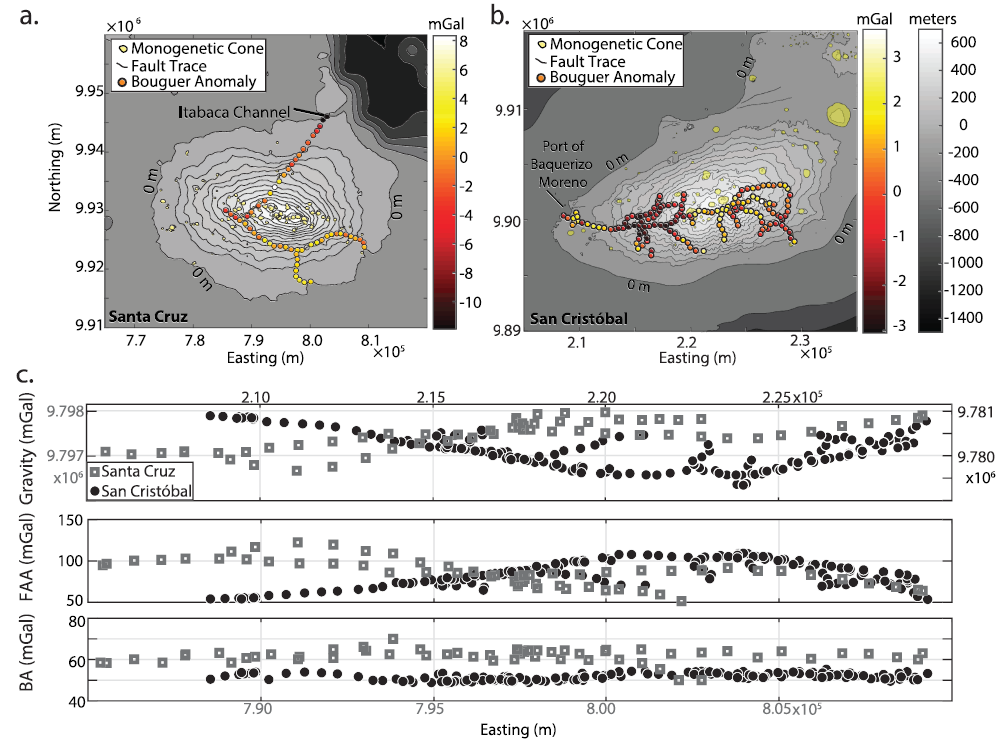

  * **Description:** Gravity data from the surveys performed as part of this study were used to calculate the Bouguer anomaly (BA) for (a) Santa Cruz and (b) San Cristóbal. For each island, (c) the (top) measured gravity, (middle) free air anomaly (FAA), and (bottom) Bouguer anomaly (BA) are shown. Note that color differences in Gravity axis labels correspond to the appropriate colors of the data symbols (Santa Cruz, gray and left axis; San Cristóbal, black and right axis).

* **Paper:** *Dynamic Magma Storage at Near‐Ridge Hot Spots: Evidence From New Galápagos Gravity Data*
  * **PDF Location:** `Galapagos/2020_Galapagos_1.pdf`

2 **Screenshot:**
 
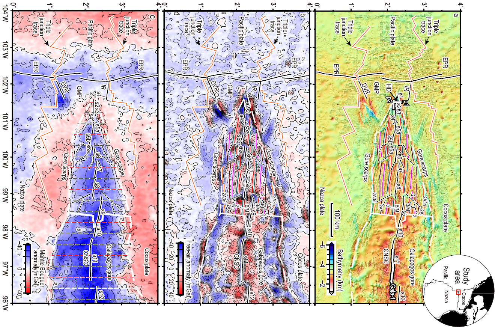

  * **Description:** Free air anomaly (mGal)

3 **Screenshot:**
 
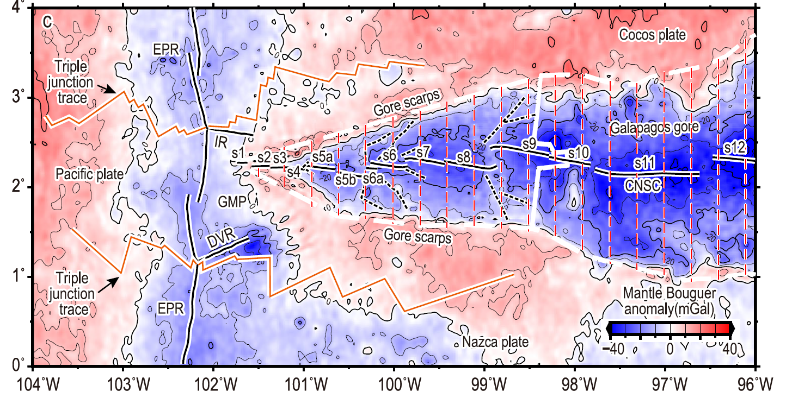

  * **Description:** Mantle bouguer anomaly (mGal)

4 **Screenshot:**
 
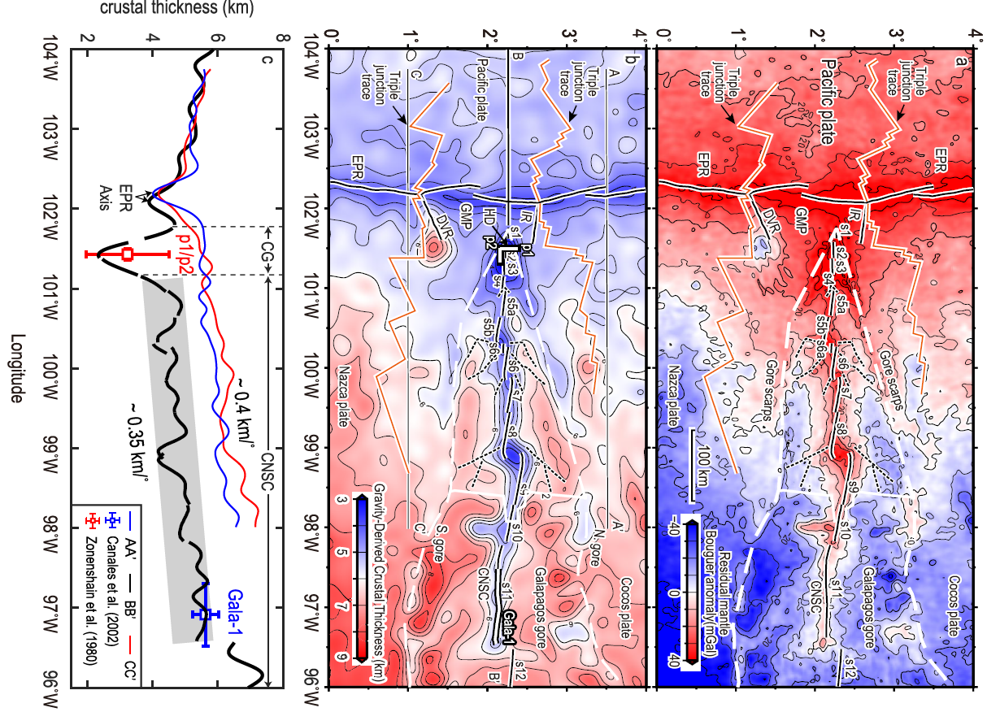

  * **Description:** (a) Map of residual mantle Bouguer anomaly (RMBA) with a contour interval of 10 mGal; labeling as in Figure 1. The CNSC-generated crust within the Galapagos gore shows slightly less positive RMBA than the EPR-generated crust outside of the gore, except in the gore tip area (segments s1 to s3). (b) Gravity-derived crustal thickness derived from (a) with a 7.5 km shift to match seismic results from Zonenshain et al. (1980) and Canales et al. (2002). The contour interval
is 0.5 km. West-east lines A-A’ to C-C’ locate profiles in (c). (c) West-east profiles noted in (b), showing crustal thickness across the EPR and along the CNSC. The tip area includes segments s1 to s3 (CG), where EPR crust is being rifted; the CNSC is spreading between the Cocos and Nazca plates. Gray bar shows the west-to-east crustal thickening trend along the CNSC. Note that the eastern flank of the EPR-generated crust follows a similar west-to-east crustal thickening trend (blue and red lines).

5 **Screenshot:**
 
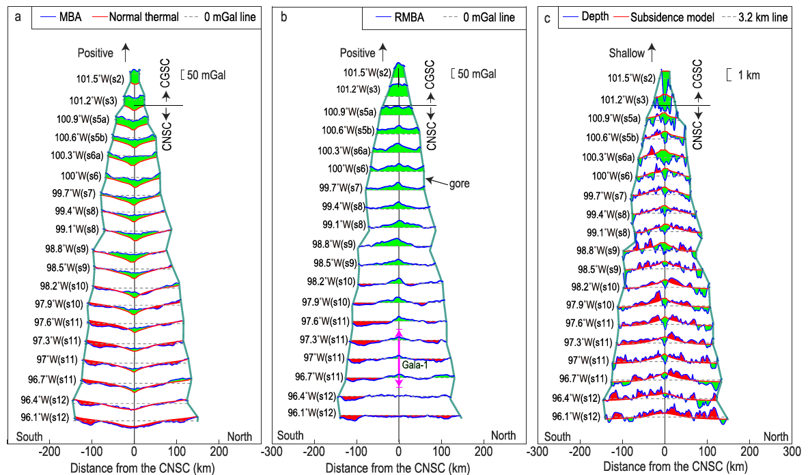

  * **Description:** Cross-axis profiles of the CGSC and CNSC within the Galapagos gore, labeled by longitude and segment number.
Profile locations are in Figure 1c; lines are at intervals of 0.3° longitude. (a) MBA (blue line) and standard thermal model (red
line). Misfits between MBA and standard thermal model are filled with red and green. Light blue lines marks gore scarps. (b)
RMBA calculated from standard thermal model. Green fill (elevated RMBA) implies thinner crust and red fill implies thicker
crust. Arrow line locates seismic refraction line Gala-1 (Canales et al., 2002). (c) Bathymetry (blue lines) and subsidence
calculated from standard thermal model (red lines). Misfits are emphasized by red and green fill.

* **Paper:** *Gravity Anomalies and Implications for Shallow Mantle Processes of the Western Cocos-Nazca Spreading Center*
  * **PDF Location:** `Galapagos/2023_GravityAnomalies_Galapagos.pdf`

---

### Archipelado: Reunion

1 **Screenshot:**
 
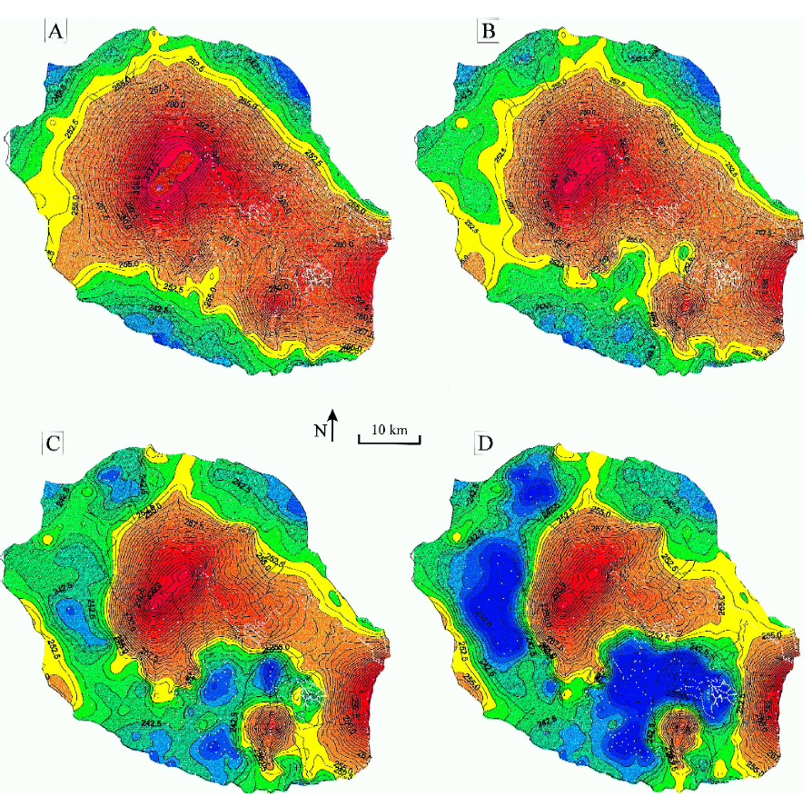

  * **Description:** Bouguer anomaly maps of Re´union Island computed with all available data. The density corrections are 2.5=103 kgrm3 A., 2.7=103 kgrm3 B., 2.9=103 kgrm3 C. and 3.1=103 kgrm3 D.. Contour interval is 2.5 mGal.

2 **Screenshot:**
 
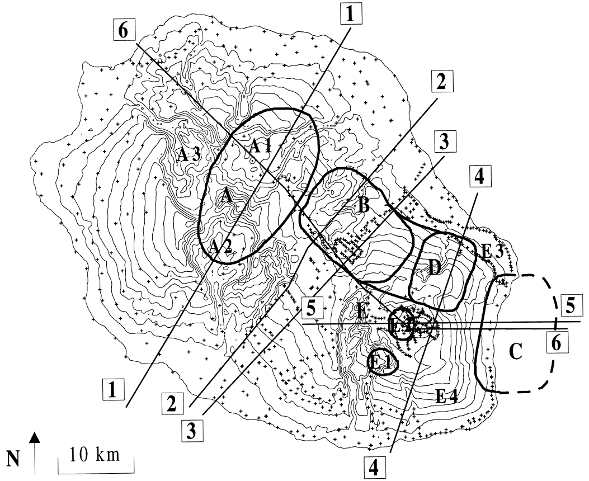

  * **Description:** Interpretative scheme of the distribution of Bouguer anomalies on Re´union Island, on a topographic base map of the island contour interval: 250 m.. Labels refer to dense structures described in the text. Their boundaries are based on visual interpretation of the Bouguer
anomaly maps and on results from 2.5D models presented in the next figures the six cross-sections are located on the map.. Eastern boundaries of body C dashed lines. are based on results from previous detailed gravity surveys conducted in the area see text.. Available gravity data are represented as crosses.

3 **Screenshot:**
 
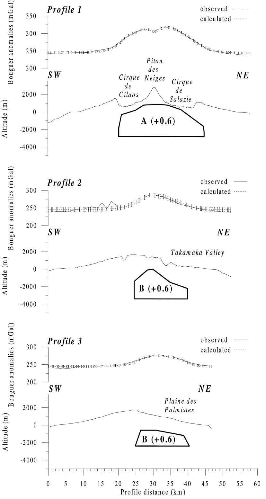

  * **Description:** 2.5D models on SW–NE profiles 1, 2 and 3 shown in Fig. 4. on the western side of the island. The observed curve gravity field obtained for a correction density of 2.7=103 kgrm3. is drawn only in areas where data have been acquired. Density contrasts are in 103 kgrm3 and errors on calculated gravity field are rms errors.

4 **Screenshot:**
 
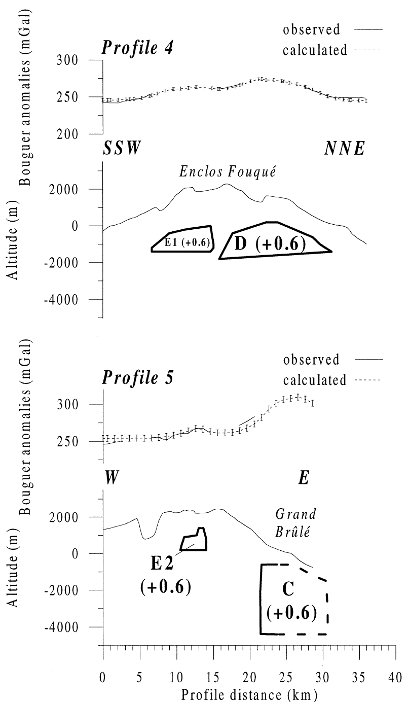

  * **Description:** 2.5D models on profiles 4 and 5 shown in Fig. 4. on the
eastern side of the island. The observed curve gravity field obtained for a correction density of 2.7=103 kgrm3. is drawn only in areas where data have been acquired. Density contrasts are
in 103 kgrm3 and errors on calculated gravity field are rms errors. Eastern boundaries of body C are drawn as dashed lines as they are based on results from previous detailed gravity surveys (see text).

5 **Screenshot:**
 
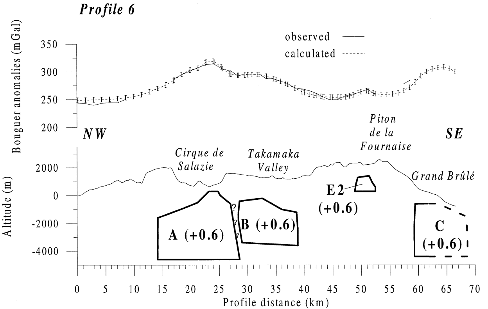

  * **Description:** 2.5D model on the NW–SE profile 6 shown in Fig. 4. The observed curve gravity field obtained for a correction density of 2.7=103 kgrm3. is drawn only in areas where data have been acquired. Density contrasts are in 103 kgrm3 and errors on calculated gravity field are rms errors. Eastern boundaries of body C are drawn as dashed lines as they are based on results from previous detailed gravity surveys see text..

6 **Screenshot:**
 

  * **Description:** Theoretical model showing the relation between the anomaly pattern and the variable height of gravity stations when a density contrast exists at shallow depth.

* **Paper:** *Structure of Re´union Island Indian Ocean/ inferred from the
interpretation of gravity anomalies*
  * **PDF Location:** `Reunion/1999_ReunionIsland.pdf`

7 **Screenshot:**
 
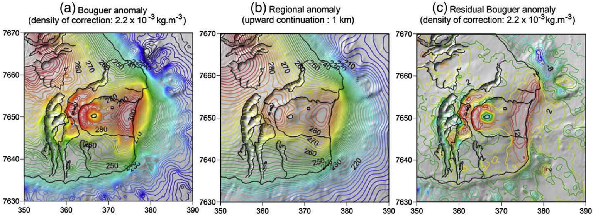

  * **Description:** (a) Bouguer anomaly map computed for a density correction of 2.2×103 kg m−3; (b) regional anomaly obtained with a 1 km upward continuation; (c) residual gravity map
obtained by subtracting the regional anomaly from the observed one; this residual anomaly is built to extract the short-wavelength signal. Coordinates in kilometers (WGS84,UTM40S). (For interpretation of the references to color in this figure legend, the reader is referred to the web version of this article.)

8 **Screenshot:**
 
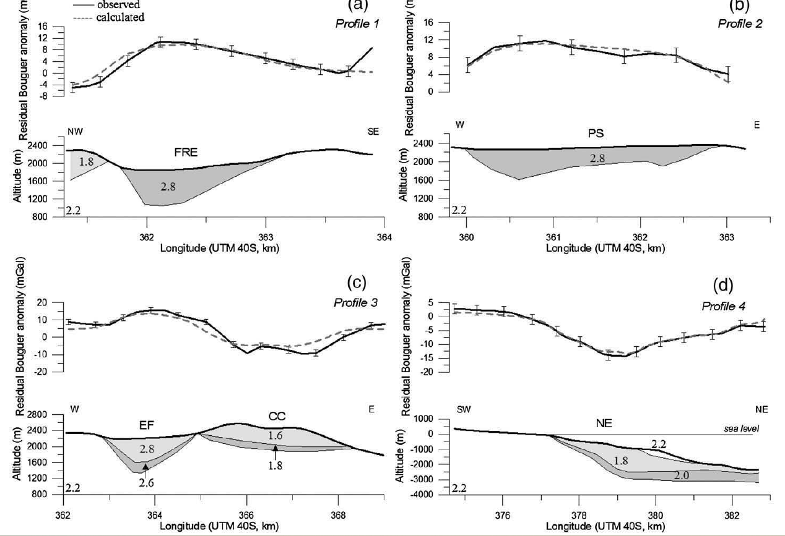

  * **Description:** 2D 1/2 and 2D 3/4 models (profiles are located in Fig. 4) of the short-wavelength anomalies from the residual gravity field (Fig. 3c): (a) profile 1 in Fond de la Rivière de l'Est (FRE) area. The 2D 3/4 structure is limited to a distance of 2 km southward and 5 km northward; (b) profile 2 in Plaine des Sables (PS) area .The 2D 1/2 structure is limited to a
distance of 4 km perpendicular to the profile in both directions; (c) profile 3 in Central Cone (CC) and Enclos Fouqué (EF) areas. The 2D 1/2 structure is limited to a distance of 2 km
perpendicularly to the profile direction for Central Cone (CC) and of 5 km for Enclos Fouqué (EF); (d) profile 4 in the offshore NE rift zone (NE) area. The 2D 3/4 structure is limited to
a distance of 7 km south-eastward and 3 km north-westward from the profile direction. Densities are in 103 kg m−3. The observed gravity curve is calculated for a correction density
of 2.2×103 kg m−3, error bars are shown.

9 **Screenshot:**
 
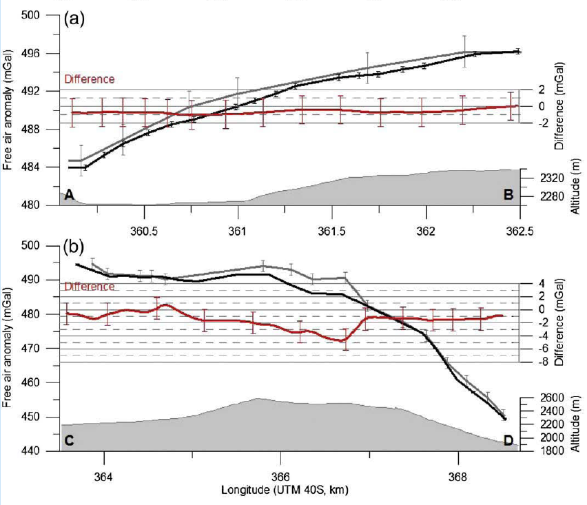

  * **Description:** Comparison of pre- and post-April 2007 gravity anomalies along profiles: (a) Plaine des Sables area; (b) Central Cone area.

10 **Screenshot:**
 
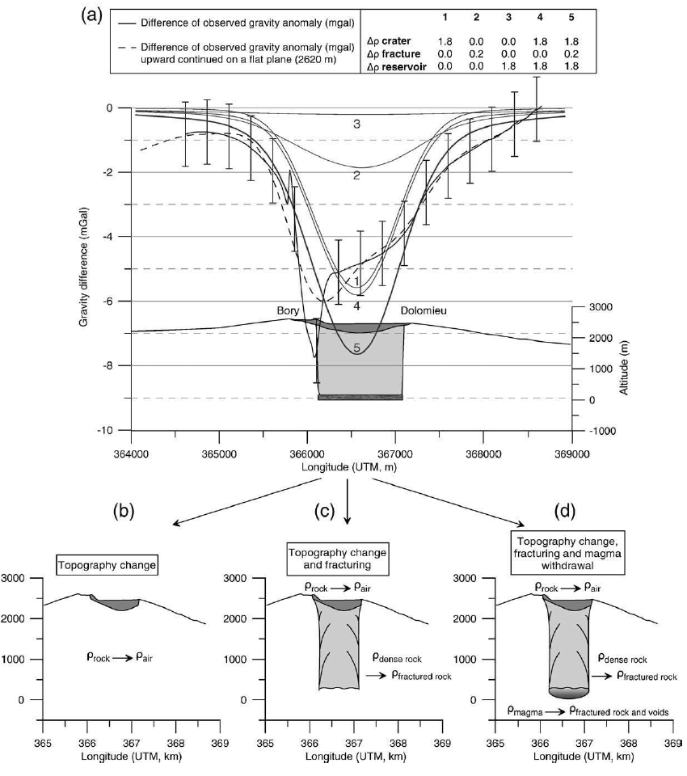

  * **Description:** Conceptual models explaining the free air anomaly decrease after the summit collapse. (a) WE profiles across 3D models (7650.25 km in latitude); the 3D models are
computed on a flat plane at 2620 m asl. They show the individual and combined contributions of the different structures considered in the text. Coordinates in meters (WGS84,UTM40S). Errors bars are rms errors calculated for the free air anomaly difference. (b) to (c): possible sources for the observed density decrease.

* **Paper:** *Gravity structure of Piton de la Fournaise volcano and inferred mass transfer during
the 2007 crisis*
  * **PDF Location:** `Reunion/2009_Gailleretal_Piton_JVGR.pdf`

11 **Screenshot:**
 
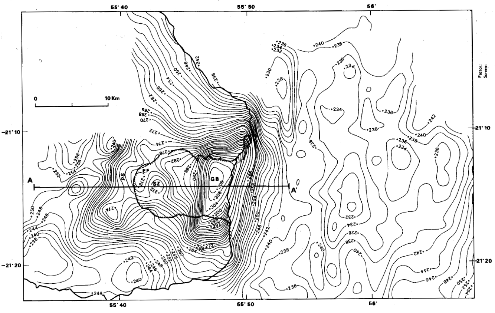

  * **Description:** Bouger anomaly map for d = 2.7gcm^-3. Contour interval is 2 mGal. GB = Grand Brulé anomaly; SZ = summit zone anomalt; PS = Plaine des Sables anomaly; EF = Enclos Fouqué anomaly.

12 **Screenshot:**
 
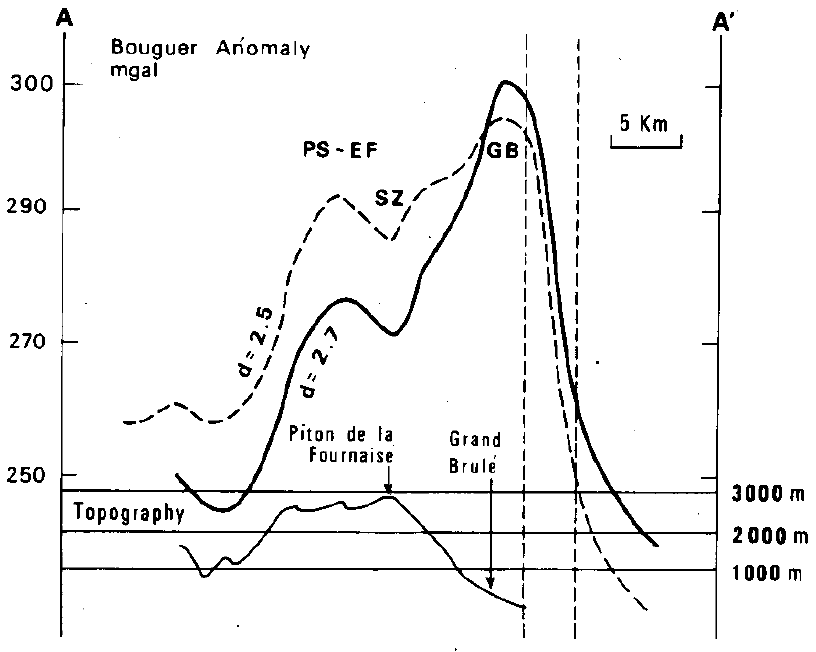

  * **Description:** Bouger anomalies computed with d = 2.5 and d = 2.7 gcm^-3 and topography profiles. Vertical dashed lines indicate the zone without data. Bouger and topographic corrections have opposed signs and their combinations depend on density and elevation values. This explains that for elevations near sea level the Bouger anomaly computed with d = 2.5 gcm^-3 becomes lower than the onde computed with d = 2.7 gcm^-3.

13 **Screenshot:**
 
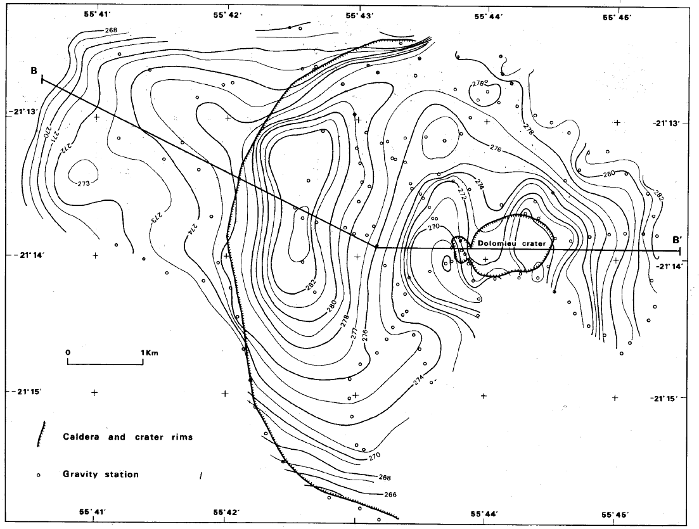

  * **Description:** Bouger anomaly map, d = 2.7gcm^-3, of the summit zone. Countour interval 1mGal.

14 **Screenshot:**
 
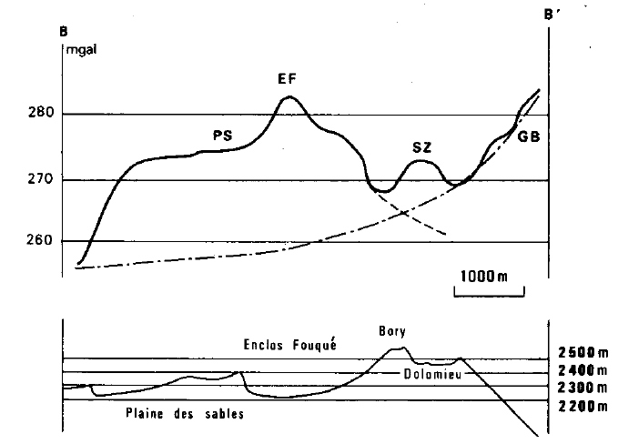

  * **Description:** BB' topographic (lower part of the figure) and Bouger anomaly (upper part) profiles across the summit zone. Solid line = Bouger anomaly; dashed line= extrapolation of the effect of the Gran Brule and Plaine des Sables heavy zones.

15 **Screenshot:**
 
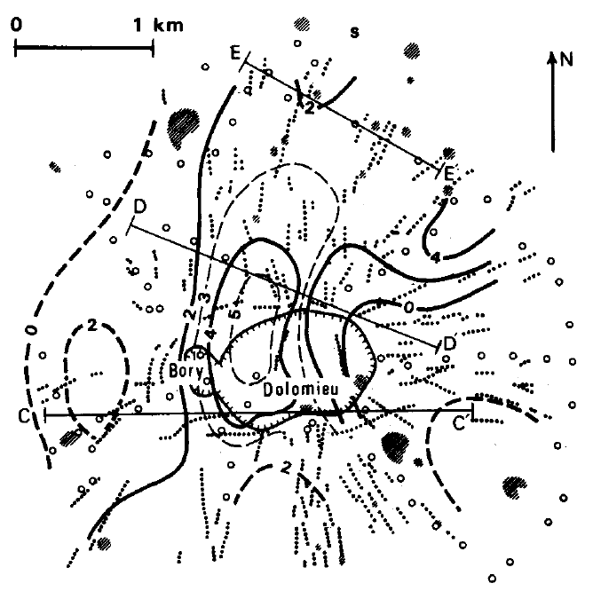

  * **Description:** Residual anomaly of the summit zone and relations with active structures. Open circles = gravity stations; shaded area = emissive cone; dotted line = emissive fissure. Countour interval 1 mGal.

16 **Screenshot:**
 
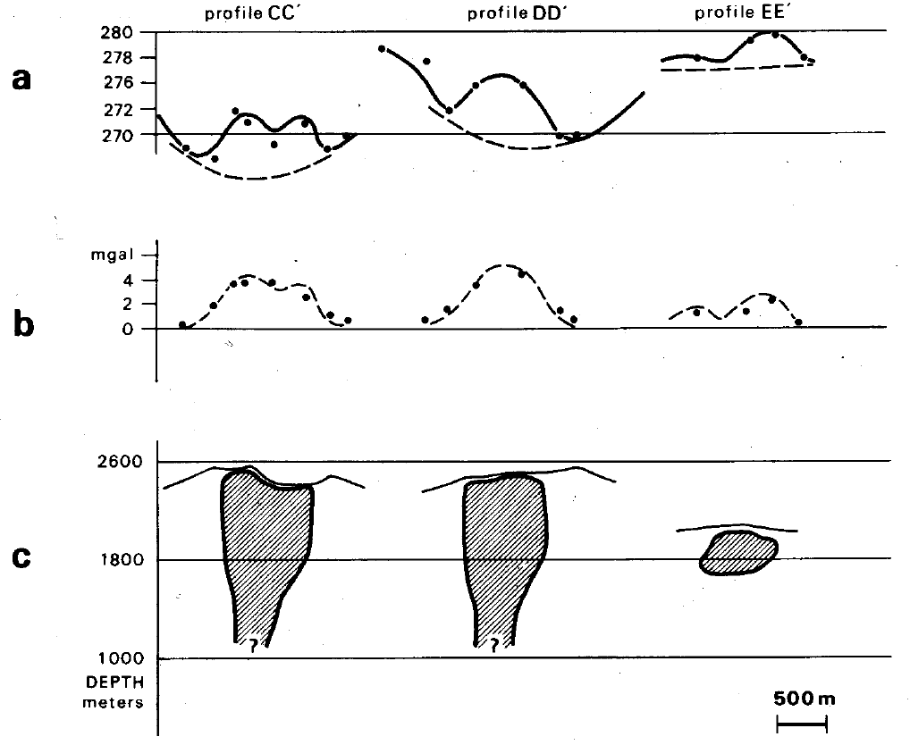

  * **Description:** Direct three dimensional study of the summit zone. The computed model is shown on three sections. a) Bouger anomaly profile (d = 2.7 gcm^-3). Dashed line = regional anomaly used; solid line = smoothed Bouger anomaly; dots = actuales nearest values. b) Computed anomaly (dots) and residual anomaly (dashed line). c) Cross sections through three dimensional model for a homogeneous density of 0.gcm^-3.

* **Paper:** *Complete study of Piton de la Fournaise volcano, Reunion Islan *
  * **PDF Location:** `Reunion/Complete_gravity_study_of_Piton_de_la_Fo.pdf`

---
### Hawaii islands

**Screenshot:**
 
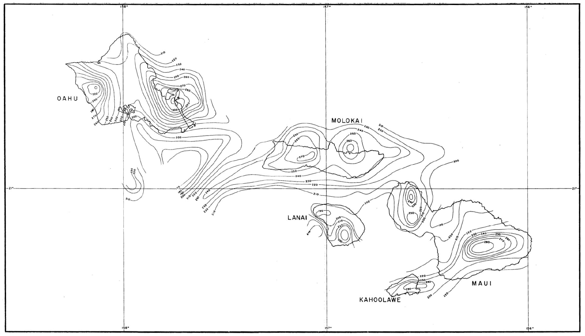

* **Description:** Bouguer anomaly map of a section of the Hawaiian Ridge; P=2.3 gl ee. Contour int ervals are at 10 mgal.

**Screenshot:**
 
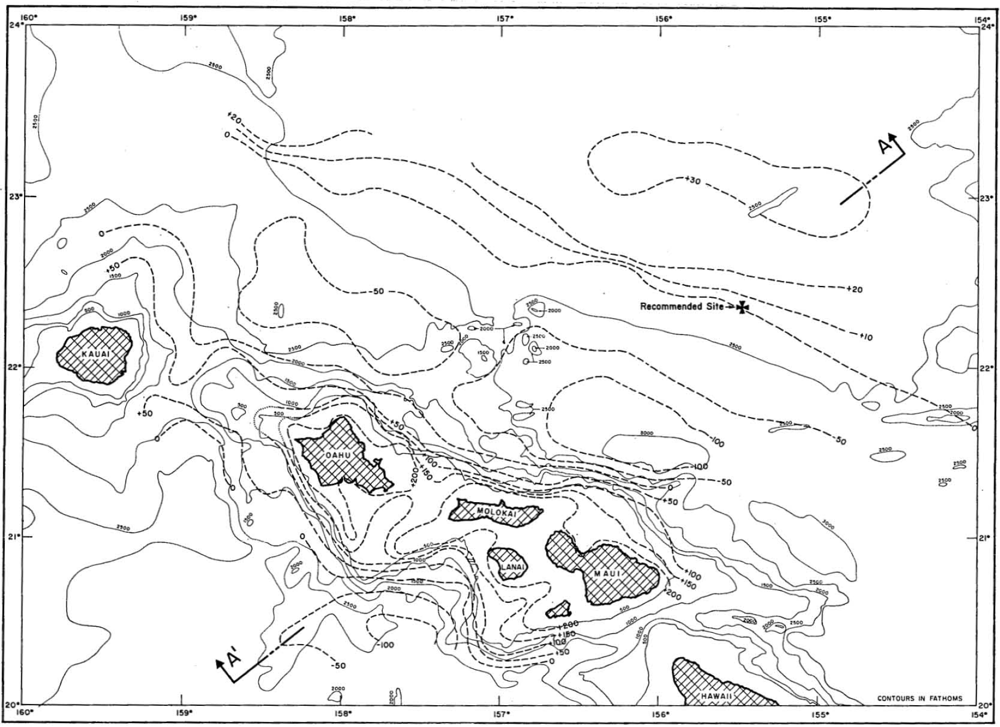

* **Description:** Free air anomaly (dash ed lin es ) gravity map of the Hawaiian Islands (values in mill igals) . Bathymetry
contours ( solid lines) in fathoms.

* **Paper:** *An Analysis of the Gravity Field Over the Hawaiian Islands
in Terms of Crustal Structure*
* **PDF Location:** `Hawaii/1965_Hawai_Islands_1.pdf`

**Screenshot:**
 
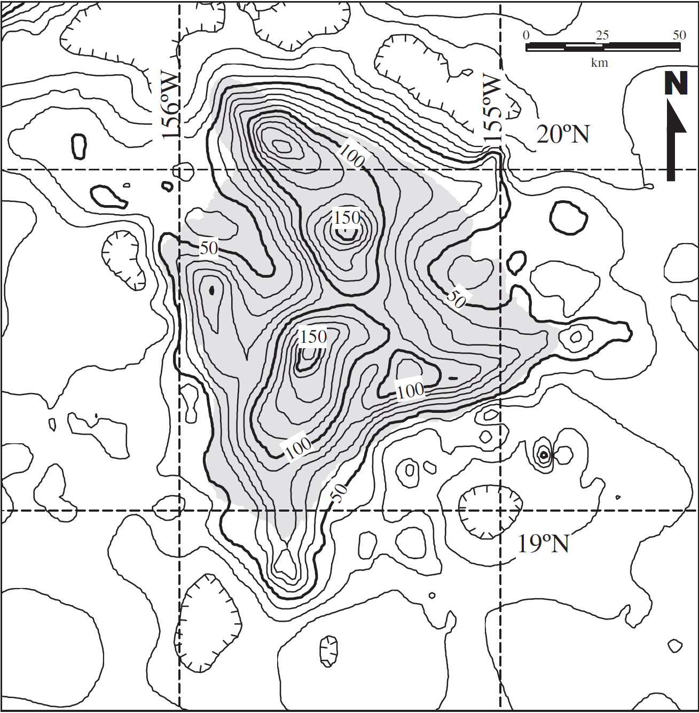

* **Description:**Map of study area showing contoured residual gravity field
over island of Hawai‘i. Contour interval is 10 mGal. Island is shaded

* **Paper:** *Deep magmatic structures of Hawaiian volcanoes, imaged by
three-dimensional gravity models*
* **PDF Location:** `Hawaii/2000_BigIslandHawaii_2.pdf`

**Screenshot:**
 
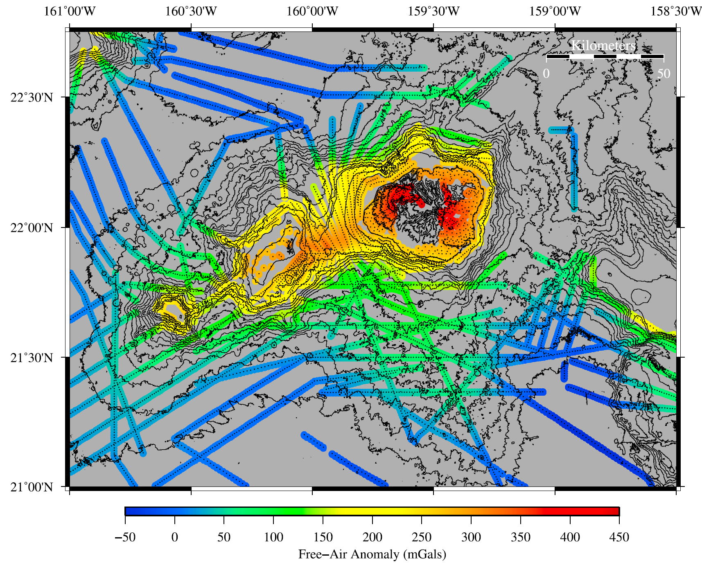

* **Description:**Free‐air anomaly (FAA) map of Kaua’i, Ni’ihau, and the surrounding submarine area.

**Screenshot:**
 
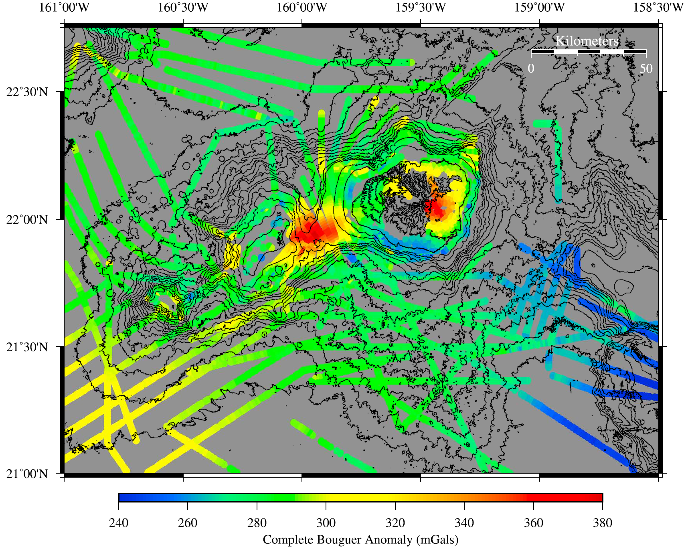

* **Description:*Complete Bouguer anomaly map of Kaua’i, Ni’ihau, and the surrounding submarine area.

**Screenshot:**
 
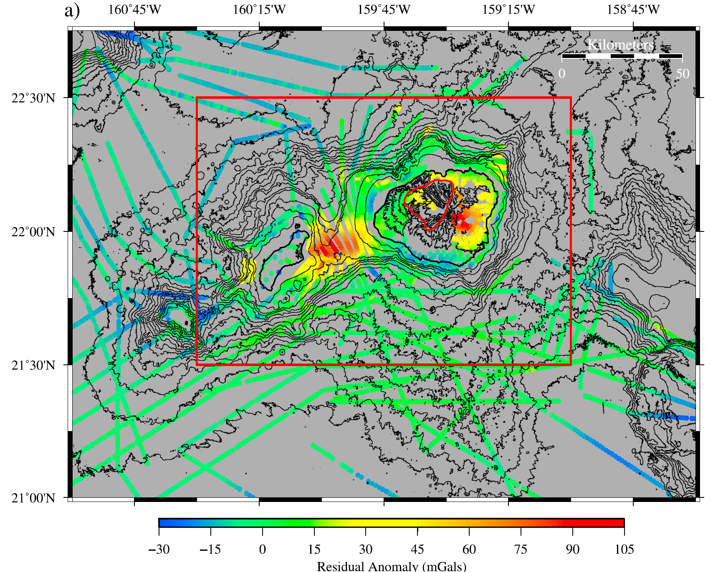

* **Description:** Residual gravity anomaly map of Kaua’i, Ni’ihau, and the surrounding submarine area. The
red box marks the region used in the inversion.

**Screenshot:**
 
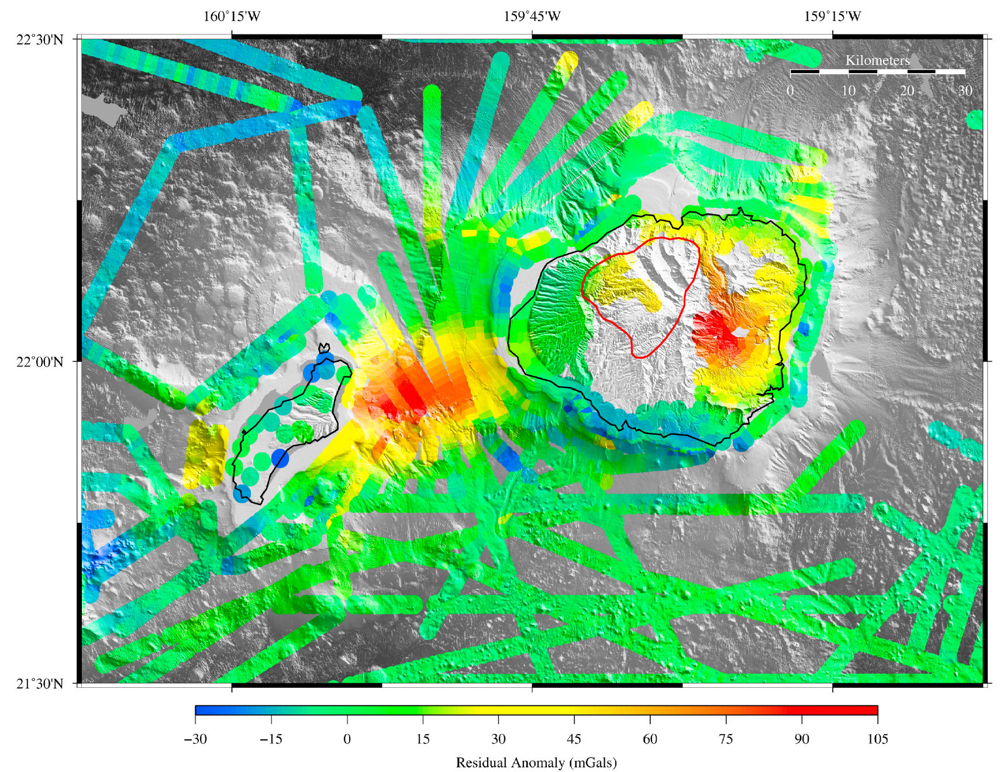

* **Description:** Detailed residual gravity anomaly map (color overlay) using rb = 2700 kg/m3, ra = 2400 kg/m3, and Te = 35 km,
draped over gray shaded digital elevation, illuminated from the northeast.

* **Paper:** *Gravity anomalies of the Northern Hawaiian Islands:
Implications on the shield evolutions of Kauai and Niihau*
* **PDF Location:** `Hawaii/2010_NorthernHawaiianIslands_3.pdf`

**Screenshot:**
 
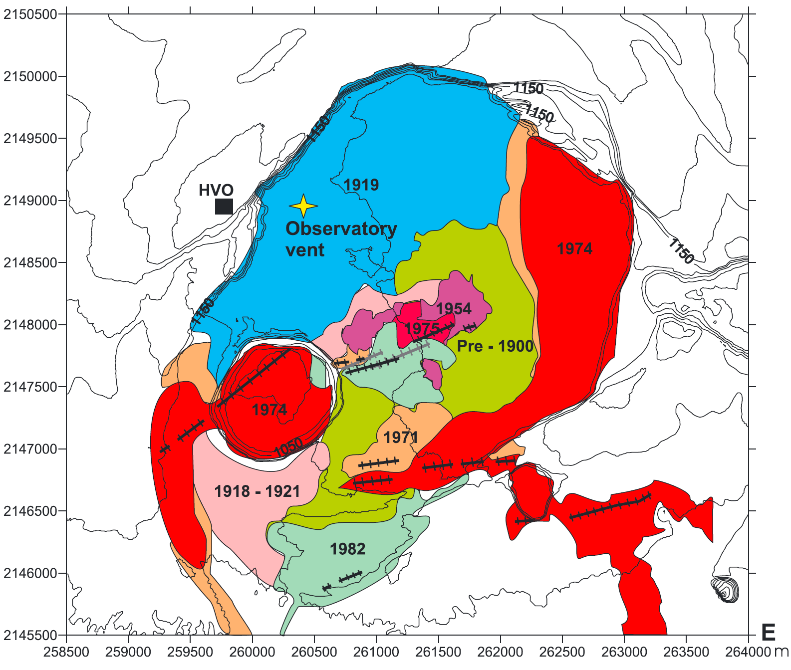

* **Description:** Geologic map of Kīlauea’s summit caldera with visible eruptive fissures represented as black
lines and buried fissures shown in gray.

**Screenshot:**
 
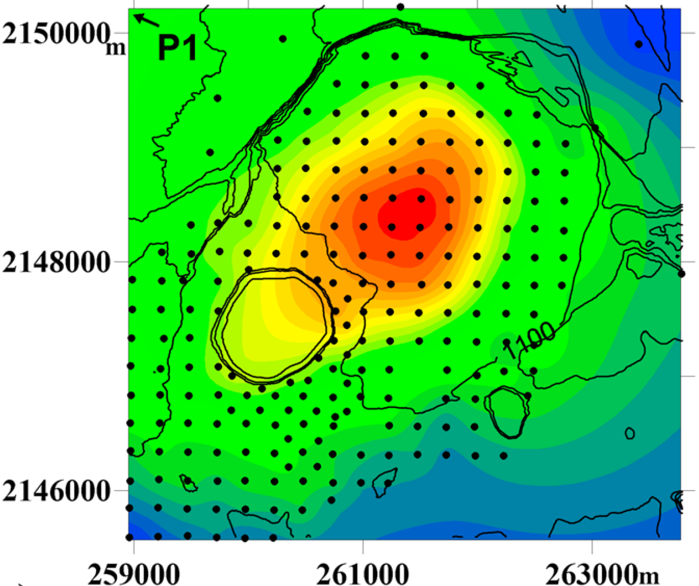

* **Description:**Bouguer gravity anomaly map corrected for terrain, earth tides, and normalized to the base
station. Black dots are the measurement locations.

**Screenshot:**
 
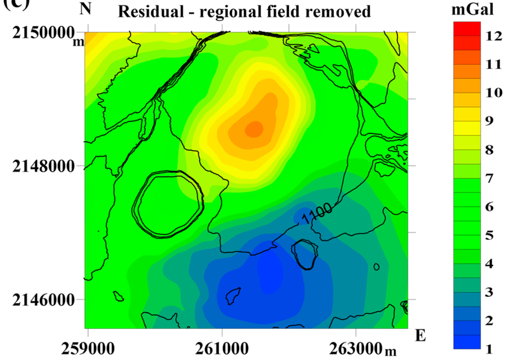

* **Description:**Residual Bouguer gravity anomaly map where the regional field
from part B has been removed.

* **Paper:** *The shallow structure of Kīlauea caldera from high-resolution
Bouguer gravity and total magnetic anomaly mapping:
Insights into progressive magma reservoir growth*
* **PDF Location:** `Hawaii/2013_KilaueaVolcano_4.pdf`

**Screenshot:**
 
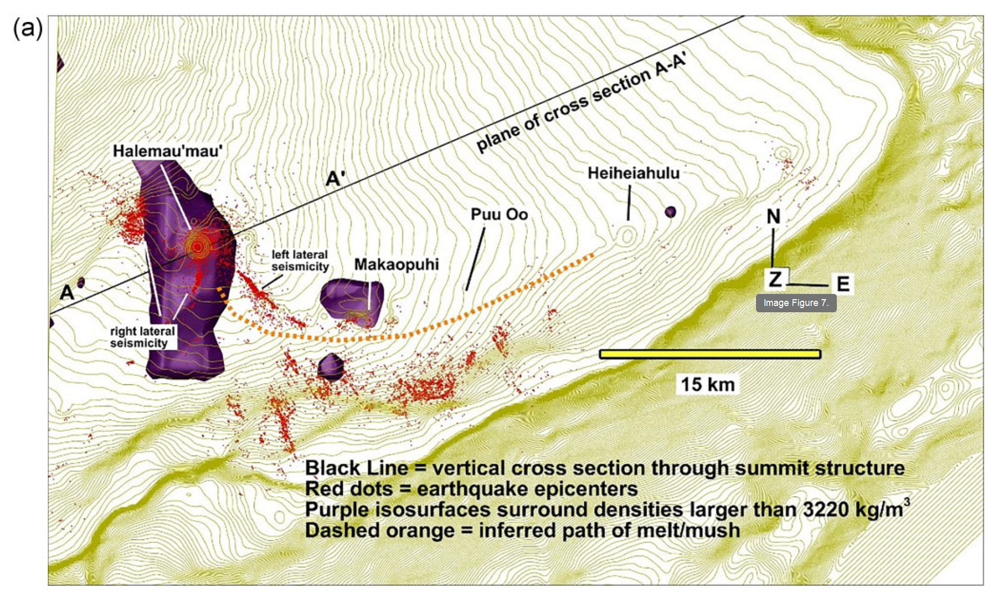

* **Description:** Map view of dense bodies in Fig. 6 , with seismicity and orientation of vertical cross-section in (b). The cross-section intersects isosurfaces that define the summit density structure above the dense 3220 kg m −3 bodies shown here, and these form the trough that is flanked by strike-slip seismicity in (b).

**Screenshot:**
 
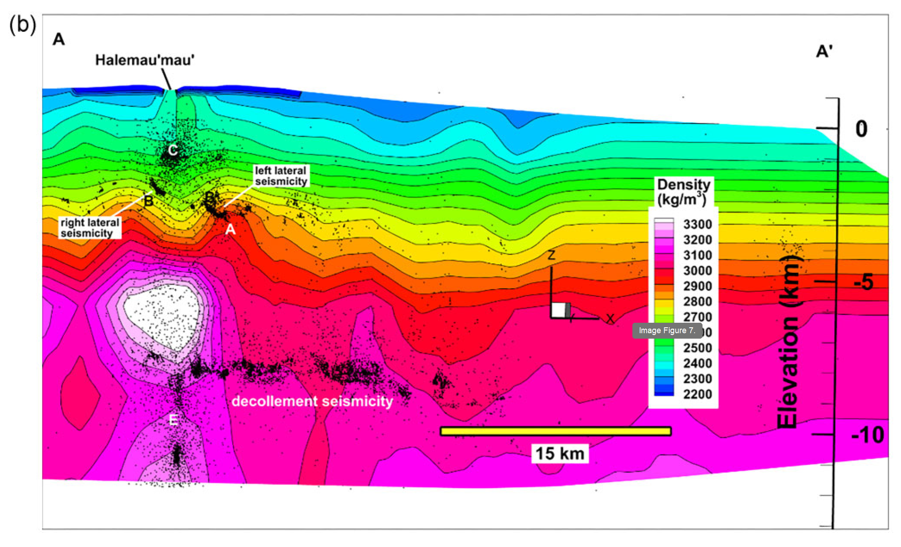

* **Description:** Vertical cross-section through seismic tomo graphy deri ved density structure that intersects the summit 3-D body and seismicity of C shown in Fig. 6 . Seismicity outside this plane are projected horizontally onto it.

**Screenshot:**
 
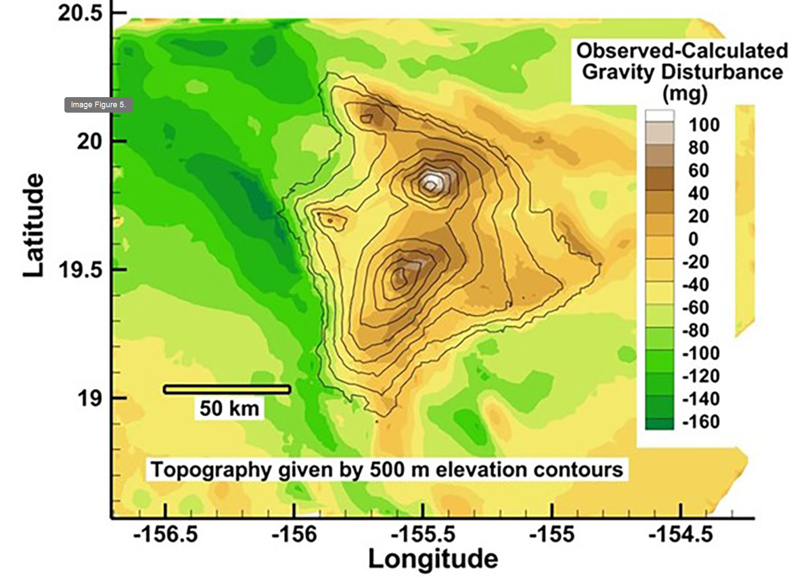

* **Description:**The distribution of the residual gravity disturbance in which the calculated values used the seismic tomography of Lin et al. ( 2014 ) to construct the 3-D domain of Denlinger & Flinders ( 2022 ).

 
* **Paper:** *Density structure of K ¯ılauea volcano: implications for magma storage and transport*
* **PDF Location:** `Hawaii/2024_BigIslandHawaii_5.pdf`

**Screenshot:**
 
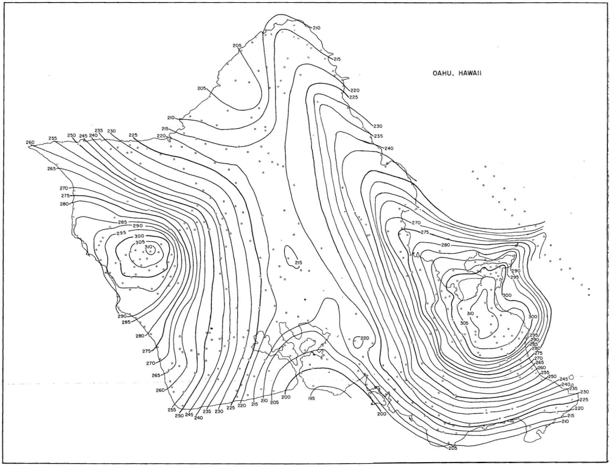

* **Description:**Bouguer gravity anomaly map of the island of Oahu, Hawaii.
* **Paper:** *Gravity Survey of the Island of Oahu, Hawaii*
* **PDF Location:** `Hawaii/oahu_HAwaii_6.pdf`

---
