# Gravity Anomaly Graphics Log

This document links screenshots to their respective original papers for the data cleaning and preprocessing study.

---
### Archipelago : Canary Islands
#### Island: Tenerife

 **Screenshot:**
 
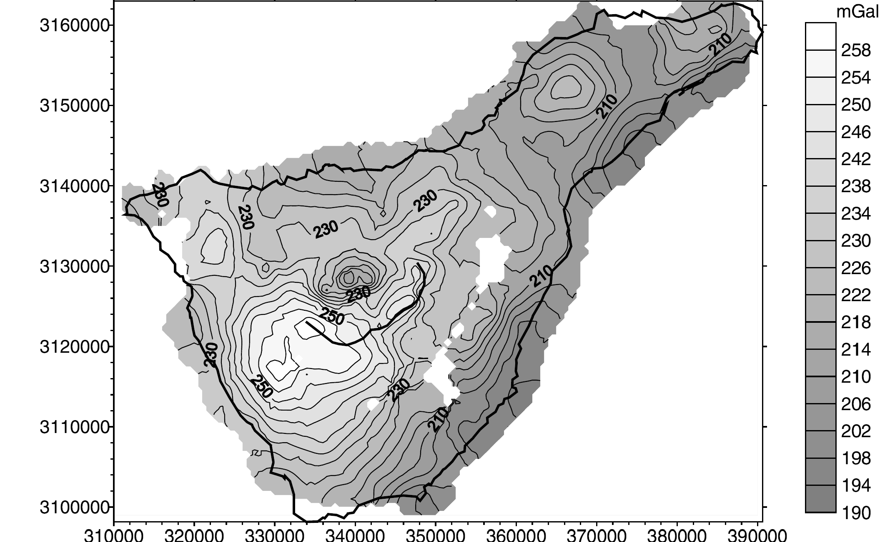

  * **Description:** Map of Bouguer gravity anomalies. The thick lines point out the coast of the island and the rim of the caldera. The white areas
correspond to gaps of data. Contour interval at 4 mGal.
* **Paper:** *Internal structure of Tenerife (Canary Islands) based on gravity,
aeromagnetic and volcanological data*
* **PDF location:** *`Canarias/Tenerife/2000_Aranaetal_Tenerife_GravMag_1.pdf`

 **Screenshot:**
 
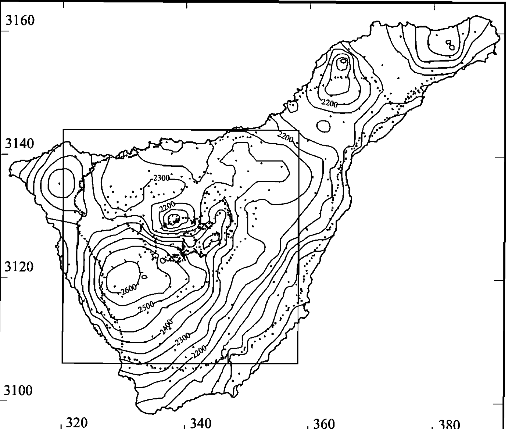

  * **Description:** Bouguer anomaly map of Tenerife. Shaded circles indicate gravity stations. Contour interval is 50 gu
  
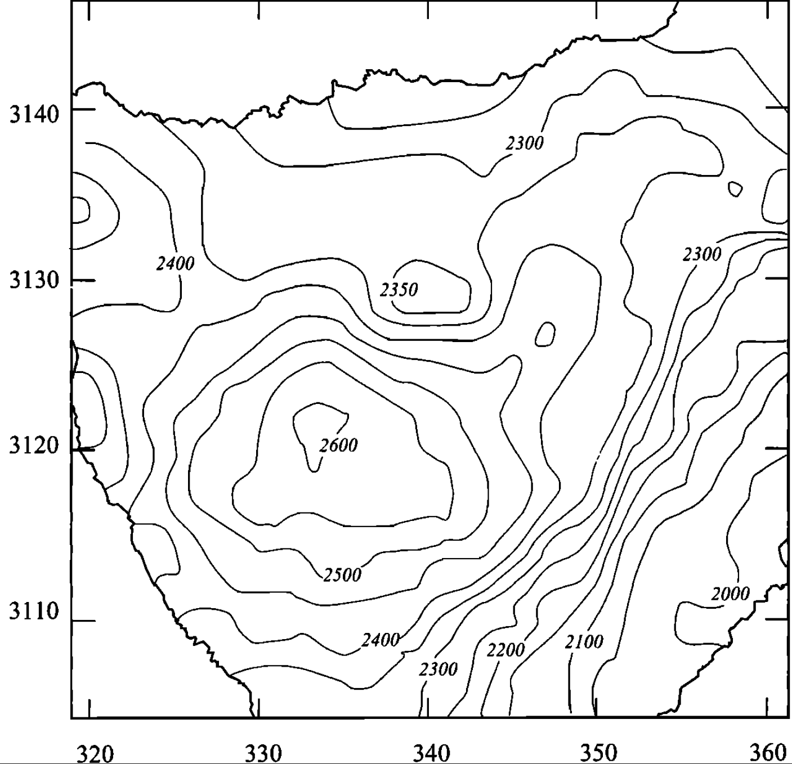
  
  
  
  * **Description:** Bouguer anomaly map for the central part of Tenerife. Contour interval is 50 gu
  * **Paper:** *Gravity constraints on the structure and volcanic evolution
of Tenerife, Canary Islands*
  * **PDF Location:** `Canarias/Tenerife/2000_TenerifeGravity_2.pdf`

---
### Archipelago : Azores Islands
#### Island: Faial

1 **Screenshot:**
 
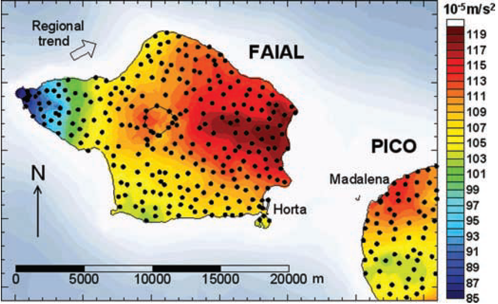

  * **Description:** Bouguer anomaly in Faial (terrain density 2390 kg m–3) supplemented with data from Pico.
 
2 **Screenshot:**
 
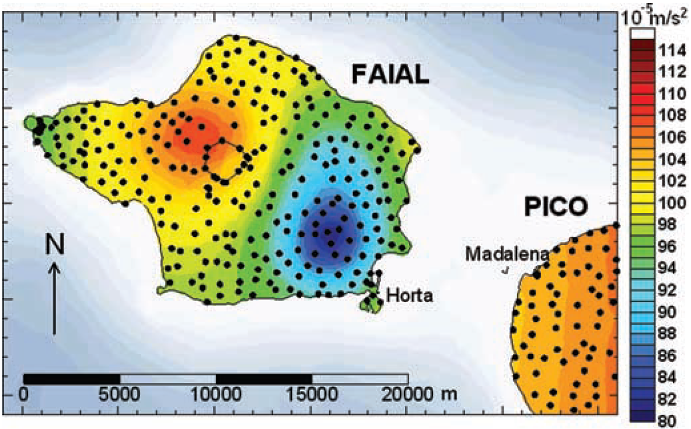

  * **Description:** Bouguer anomaly corresponding to the simulation model of Fig. 8 and a simulated trend p0 = 100.0 × 10−5 m s−2, px = 0.40 × 10−8 m s−2 m–1,
py = 0.0 m s−2 m–1 for the same stations of Faial. Tick marks in axes correspond to 1 km.
  

3 **Screenshot:**
 
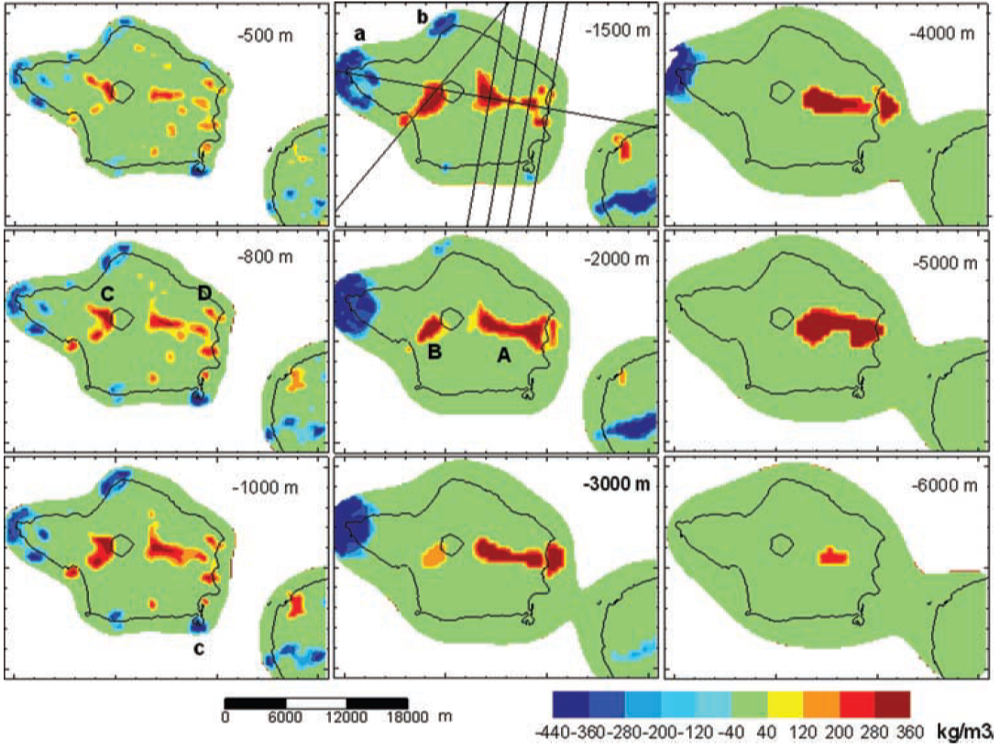

  * **Description:** Horizontal sections of the anomalous model corresponding to depths ranging from −500 to −6000 m. Section −1500 m shows the location of the
cross-sections.

4 **Screenshot:**
 
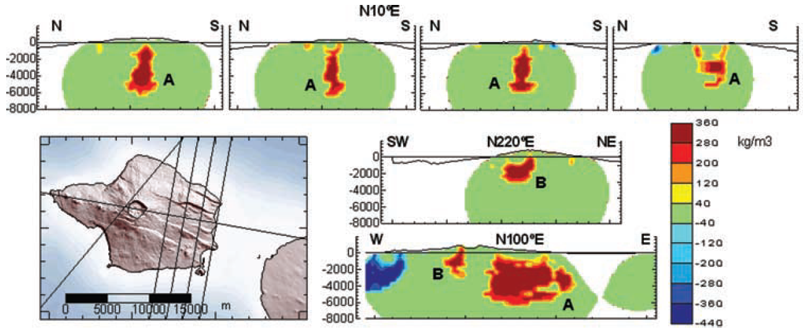

  * **Description:** Vertical profiles N10◦E, N220◦E and N100◦E and of the inversion model showing the main intrusive body A (red) with positive density contrast..

  * **Paper:** *Gravimetric determination of an intrusive complex under the Island
of Faial (Azores): some methodological improvements*
  * **PDF Location:** `VOLCANES/Azores/Faial/2007_FaialIsland_Azores.pdf`

#### Island: Pico

5 **Screenshot:**
 
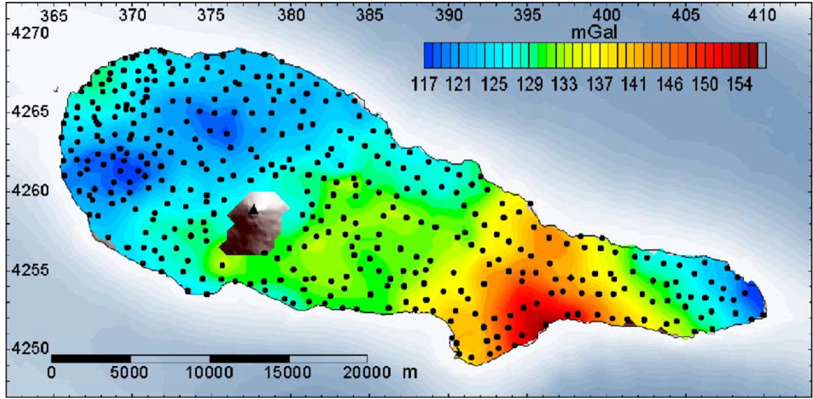

  * **Description:** Bouguer anomaly map derived from gravity data reduction for a terrain density of 2520 kg/m3 (see text for details). Dots show the location of
the 407 gravity stations occupied during the surveys. The triangle corresponds to Pico Mountain summit. UTM coordinates in km.

6 **Screenshot:**
 
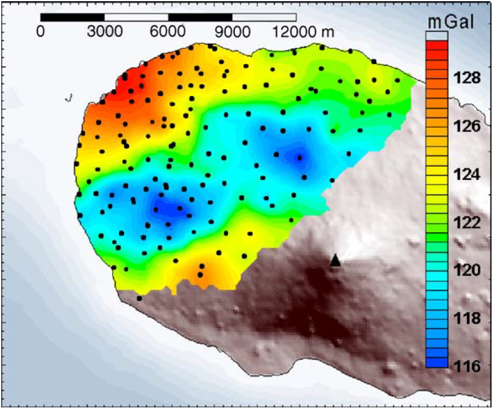

  * **Description:** Local Bouguer anomaly map for the western sector of Pico
Island obtained from a total of 154 gravity stations. Gravity reduction
using a terrain density of 2580 kg/m3. The triangle corresponds to Pico
Mountain summit.

7 **Screenshot:**
 
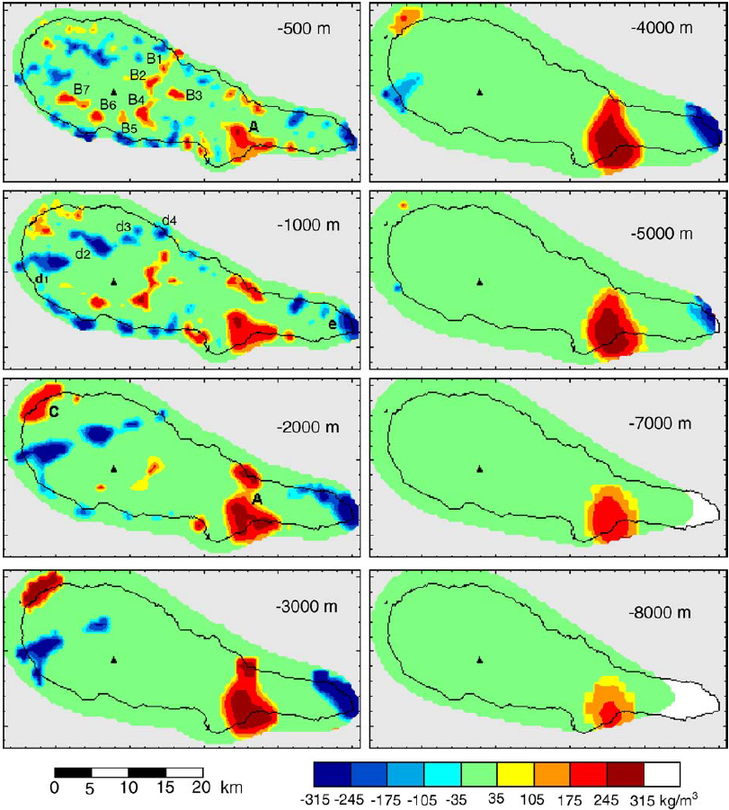

  * **Description:** Horizontal cross sections obtained from the gravity inversion model of anomalous density contrasts. Depth of the section (−500, −1000, …), in
meters, is shown on top right. The triangle corresponds to Pico Mountain summit.

8 **Screenshot:**
 
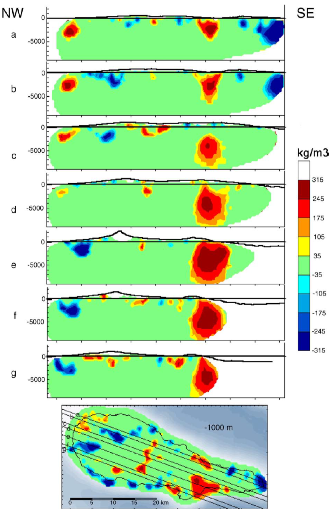

  * **Description:** Vertical profiles obtained from the gravity inversion model of anomalous density contrasts across several WNW–ESE lines.

9 **Screenshot:**
 
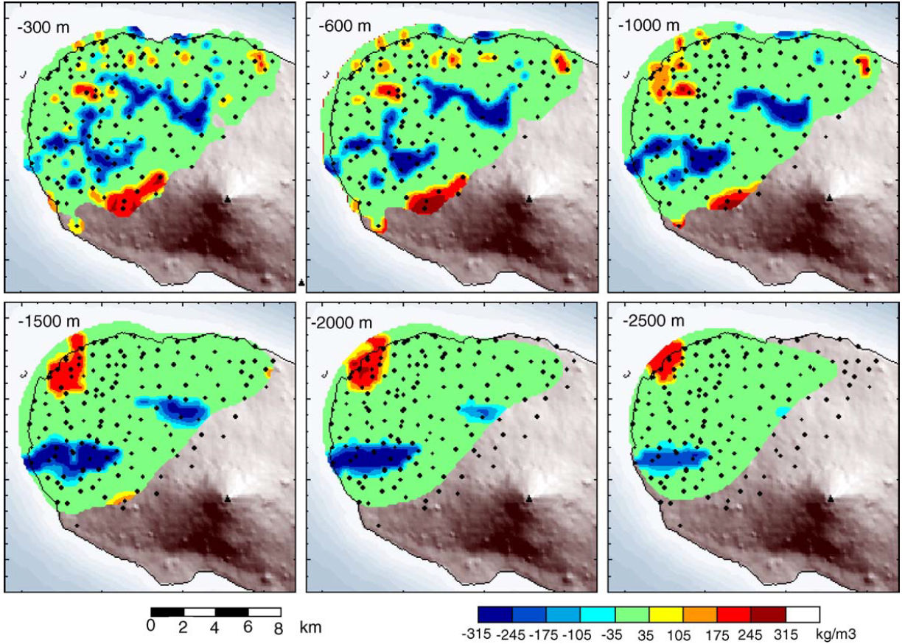

  * **Description:** Horizontal cross sections for the local model of the westernmost sector of Pico Island. Depth of the sections (−300, −600, −1000, …), in
meters, is shown on top left. The triangle corresponds to Pico Mountain summit.

* **Paper:** *Gravity anomalies and crustal signature of volcano-tectonic
structures of Pico Island (Azores)*
  * **PDF Location:** `Azores/Pico/2006_PicoIsland_Azores.pdf`
 
  
#### Island: Sao Miguel

10 **Screenshot:**
 

  * **Description:** Map of refined Bouguer anomalies deduced from observation data. Contour interval of 5mGal. Axis coordinates on Universal Transverse Mercator Projection system (m). The contours os the island and several lakes are added in this figure.

11 **Screenshot:**
 

  * **Description:** Least squares prediction model of the refined Boueger anomaly field. This model represents the optimal liner interpolation, filtering the observational noise. Contour interval of 5mGal.

12 **Screenshot:**
 

  * **Description:** Least squares prediction model of the refined Boueger anomaly field for the Furnas area. A higherresolution view. Contour interval of 2mGal.

13 **Screenshot:**
 

  * **Description:** Map of the anomaly predicition error. Contour interval of 0.1mGal. A dependence of stations distribution is observed on the error map.

14 **Screenshot:**
 

  * **Description:** Adjusted model of anomalous density contrast of Sao Miguel Island obtained from the gravimetric inversion. Horizontal sections: (a) z = -1000 m, (b) z = -4000 m, (c) z = -8000 m, (d) z = -20000 m. Vertical W-E profiles (indicated in Plate 1 d): (e) Y = 4188000, (f) Y = 4184000, (g) Y = 4,180,000, (h) Y = 4,175,000. Contour interval of 30 kg/m^3. 

15 **Screenshot:**
 

  * **Description:** Adjusted model of anomalous density contrast of the Furnas area obtained from the local gravimetric inversion. Horizontal sections: (a) z = -500 m, (b) z = -1500 m, (c) z = -2500 m, (d) z = -4000 m. Vertical W-E profiles (indicated in Plate 2 d): (e) Y = 4184000, (f) Y = 4,180,000. Contour interval of 50 kg/m^3.

* **Paper:** *A three-dimensional gravity inversion applied to Sao Miguel Island (Azores)*
  * **PDF Location:** `Azores/Sao Miguel/1997_SaoMiguelIsland_Azores.pdf`

#### Island: Terceira

16 **Screenshot:**
 
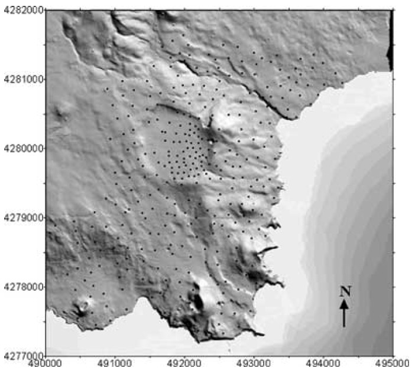

  * **Description:** Adjusted model of anomalous density contrast of the Furnas area obtained from the local gravimetric inversion. Horizontal sections: (a) z = -500 m, (b) z = -1500 m, (c) z = -2500 m, (d) z = -4000 m. Vertical W-E profiles (indicated in Plate 2 d): (e) Y = 4184000, (f) Y = 4,180,000. Contour interval of 50 kg/m^3.

17 **Screenshot:**
 
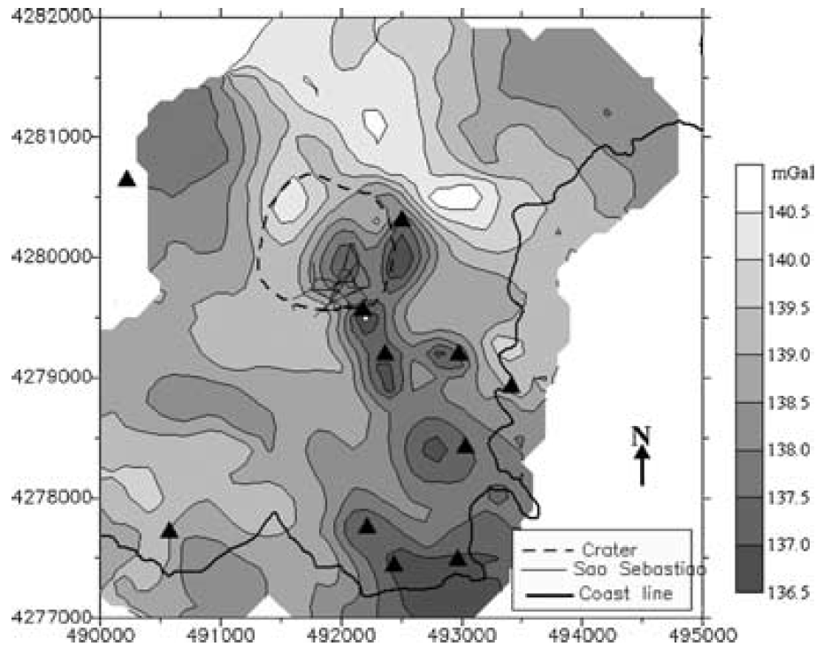

  * **Description:** Bouguer anomalies map corresponding to a terrain density value of 2480 kgm−3. Triangles point out scoria cones eruptive centres (see Table 1
and Figs 4 and 7). UTM coordinates are in metres.

18 **Screenshot:**
 
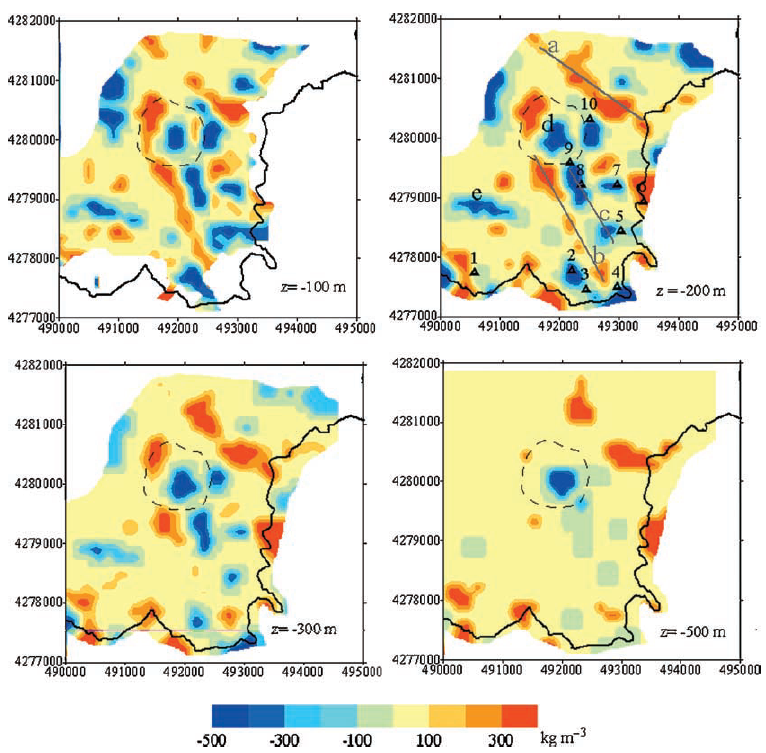

  * **Description:** Deep horizontal sections of the density contrast 3-D regional model (for −100, −200 and −500 m) for the whole studied area. The broken line
indicates the crater rim and the solid line points out the coastline. The section for −200 m includes a general interpretation about the major volcanic and tectonic
lineaments deduced for the area. In this section, triangles point out scoria cones eruptive centres and solid thick lines proposed lineaments. For reference
numbers and letters see the text and also Table 1. UTM coordinates are in metres.

19 **Screenshot:**
 
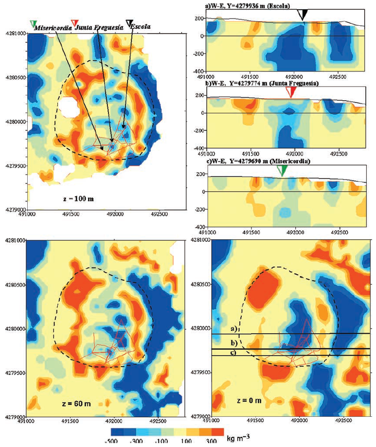

  * **Description:** Horizontal section of the density contrasts 3-D local model (for 100, 60 and 0 m a.s.l.) and E–W profiles along the lines shown in the z = 0 m
horizontal section crossing the locations of the three stations with seismic records. In the section z = 100 m and in the vertical profiles the location of these
seismic stations is indicated. Inside crater, red lines points out the main routes in the urban centre of S˜ao Sebasti˜ao. The white areas are the effect of a greater
separation between stations that produces a lack of information at that level. UTM coordinates are in metres.

* **Paper:** *A 3-D gravity model for a volcanic crater in Terceira Island (Azores)*
  * **PDF Location:** `Azores/Terceira/2003_TerceiraIsland_Azores.pdf`
 
#### The entire archipelago

20 **Screenshot:**
 
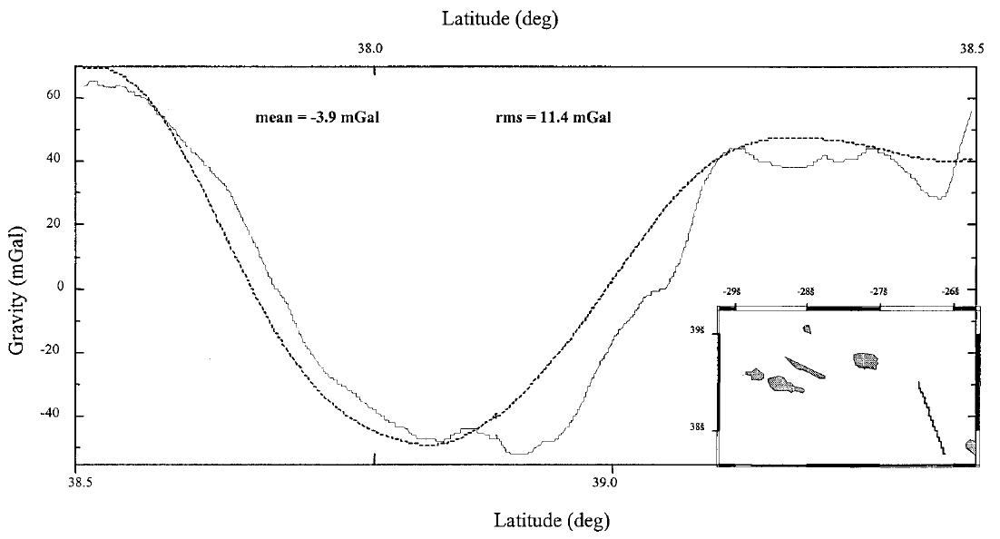

  * **Description:** Comparison between a shipboard gravity profile (solid line) and a coincidentally located satellite-derived gravity (dashed).

21 **Screenshot:**
 
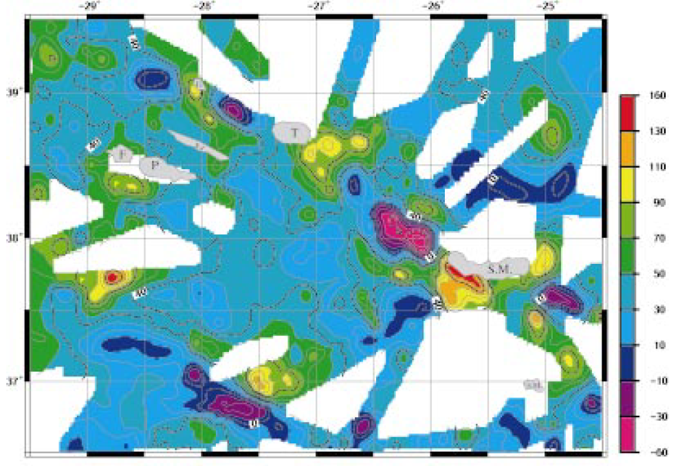

  * **Description:** Free-air gravity anomaly map (contour interval is 10 mGal. The zero level is arbitrary and corresponds to the mean value of the grid.

22 **Screenshot:**
 
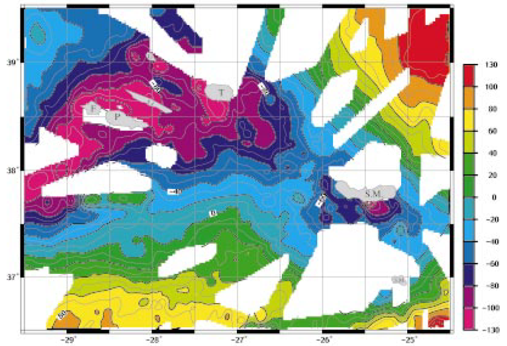

  * **Description:** Mantle Bouguer anomaly map contoured every 10 mGal. The zero level is arbitrary and corresponds to the mean value of the grid.

23 **Screenshot:**
 
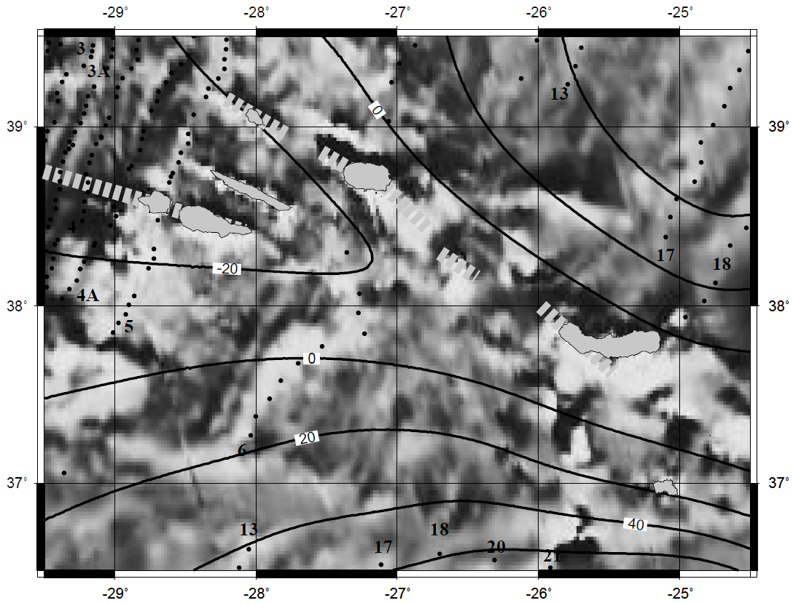

  * **Description:** Predicted gravity anomaly due to lithospheric cooling and thickening with age away from both the MAR and the Terceira Axis.
The background depicts the magnetic anomaly of Luis (1996) represented with an equalised grey scale. Lighter tones correspond to positive
anomalies and darker tones to negative anomalies. The closed symbols locate the magnetic anomaly picks (isochrons).

24 **Screenshot:**
 
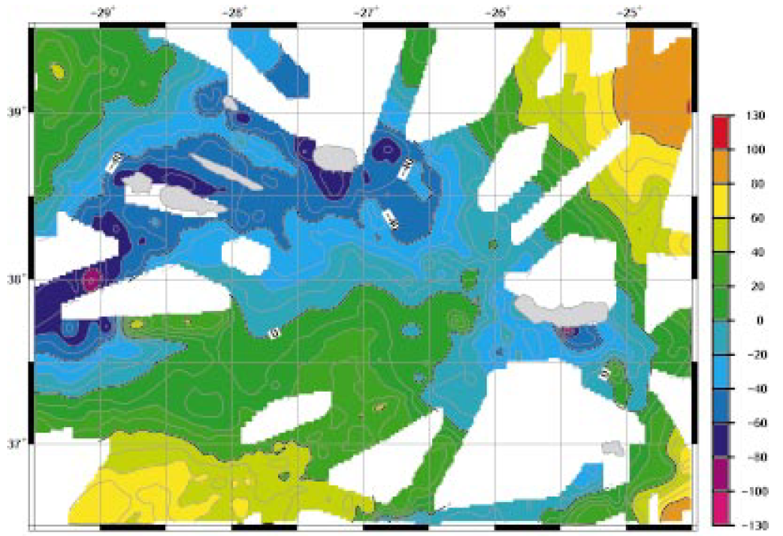

  * **Description:** Residual MBA (contour interval is 10 mGal). This residual anomaly is obtained by subtracting the MBA of Figure 5 from the
gravity effect of the crustal thickness variation displayed in Figure 6. The zero level is arbitrary.

25 **Screenshot:**
 
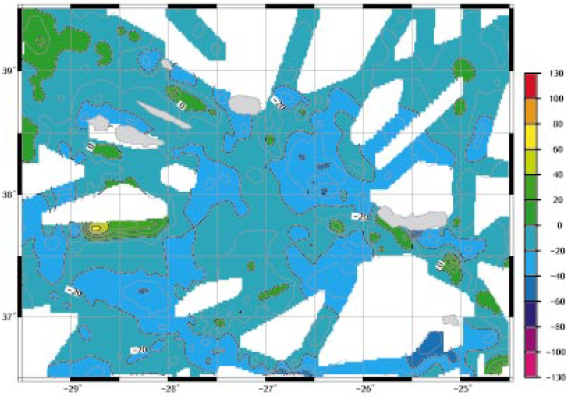

  * **Description:** Residual anomaly for the elastic plate model (contour interval is 10 mGal). This residual anomaly is obtained by subtracting the observed free-air anomaly from the theoretical
anomaly of the elastic plate model (Te D 7 km; d D 12 km; c D 2700 kg m􀀀3; m D 3300 kg m􀀀3). The zero level is arbitrary.

* **Paper:** *Constraints on the structure of the Azores spreading center from gravity
data*
  * **PDF Location:** `Azores/1999_GravityAzores.pdf`

 26 **Screenshot:**
 
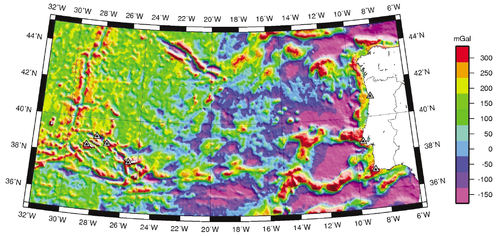

  * **Description:** Gravity field model in the North-Atlantic between Iberia and Azores archipelago resulting from the assimilation of marine gravity data into
satellite derived gravity by optimal interpolation. GPS/levelling sites are presented as triangles.

27 **Screenshot:**
 
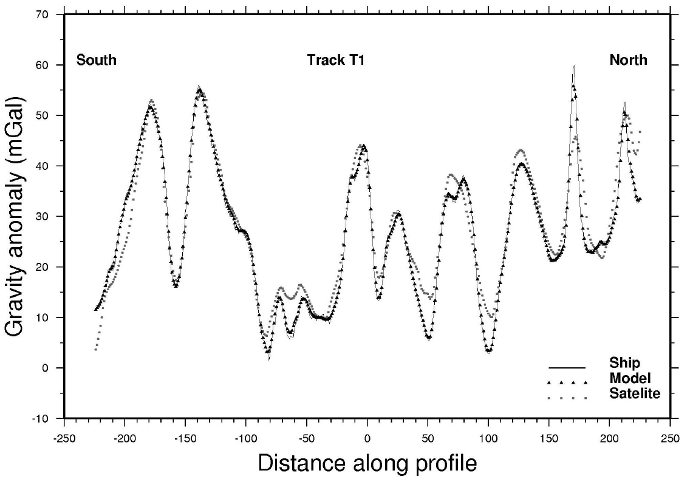

  * **Description:**Comparison of different gravity data types in a shipborne profile (T1) starting in Terceira island running to south-west.

28 **Screenshot:**
 
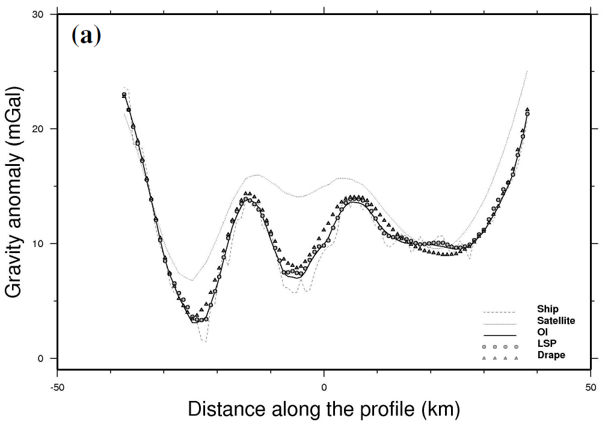

  * **Description:** Short segment of most precise shipborne track (T1).

29 **Screenshot:**
 
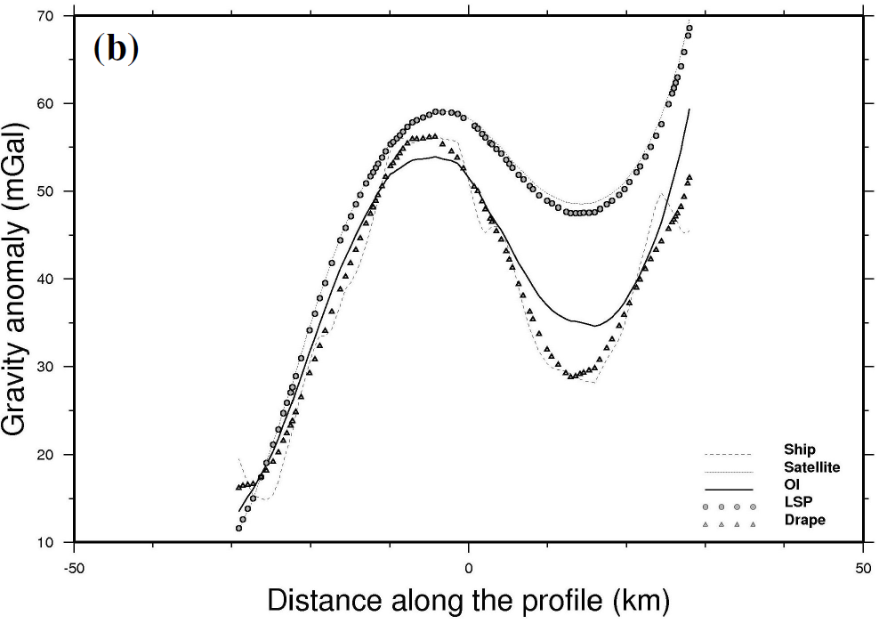

  * **Description:** Short segment of less precise ship-borne track (T2). Shipborne data (Ship), background model (satellite), derived model (OI), least squares prediction model (LSP) and drape model (DRAPE) along these tracks are superimposed.
Units mGal and km.

* **Paper:** *Iberia-Azores Gravity Model (IAGRM) using multi-source gravity data*
  * **PDF Location:** `Azores/azores_estudio_gravitatorio_2005.pdf`
---

### Archipelago : Cape Verde

---
